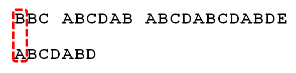
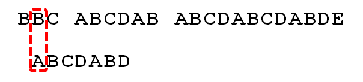
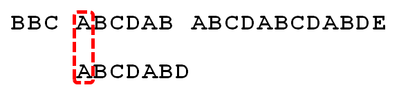
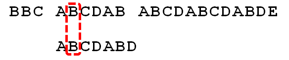
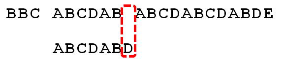
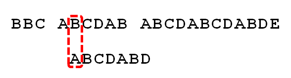
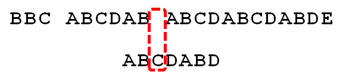
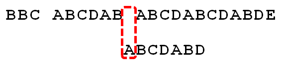
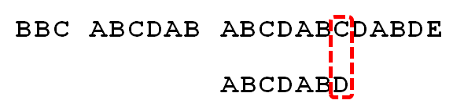
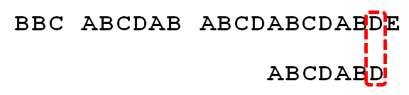

>[!note]- 题目：P3375 【模板】KMP
>
>给出两个字符串 $s_1$ 和 $s_2$，若 $s_1$ 的区间 $[l, r]$ 子串与 $s_2$ 完全相同，则称 $s_2$ 在 $s_1$ 中出现了，其出现位置为 $l$．
>
>现在请你求出 $s_2$ 在 $s_1$ 中所有出现的位置．
>
>定义一个字符串 $s$ 的 border 为 $s$ 的一个**非 $s$ 本身**的子串 $t$，满足 $t$ 既是 $s$ 的前缀，又是 $s$ 的后缀．
>
>对于 $s_2$，你还需要求出对于其每个前缀 $s'$ 的最长 border $t'$ 的长度．
>
> 对于全部的测试点，保证 $1 \leq |s_1|,|s_2| \leq 10^6$，$s_1, s_2$ 中均只含大写英文字母．

# KMP 算法的作用

KMP 算法用于在主串（`s1`）中高效查找模式串（`s2`）出现的位置．相比朴素匹配，KMP 能避免重复回溯，大大提高效率，时间复杂度为 $O(n+m)$．

# KMP 算法的原理

KMP 的核心思想是： **当匹配失败时，利用模式串自身的信息，快速移动模式串，而不是主串回退．**

这依赖于一个“部分匹配表”（fail 数组），它记录了模式串每个前缀的最长相等前后缀长度．

# 实现过程详解

## 1. 预处理 fail 数组

- `fail[i]` 表示：当匹配到模式串第 i 位失败时，下一步应该跳到模式串的 `fail[i]` 位置继续尝试．

```cpp
int t = 0;
for (int i = 1; i < s2.size(); i++)
{
	while (s2[i] != s2[t] && t)
	{
		t = fail[t];
	}
	if (s2[i] == s2[t])
	{
		fail[i + 1] = t + 1;
		t++;
	}
}
```

- 作用：为每个位置计算最长相等前后缀长度，便于失配时快速跳转．

## 2. 匹配过程

- 用变量 `t` 表示当前匹配到模式串的位置．
- 遍历主串 `s1`，每次比较 `s1[i]` 和 `s2[t]`：
    - 如果不等且 $t>0$，就用 `fail[t]` 回退模式串指针 `t`．
    - 如果相等，`t++`，继续比较下一个字符．
    - 如果 t 达到 `s2.size()`，说明找到一次完整匹配，输出匹配位置．

```cpp
t = 0;
for (int i = 0; i < s1.size(); i++)
{
	while (s1[i] != s2[t] && t)
	{
		t = fail[t];
	}
	if (s1[i] == s2[t])
	{
		t++;
	}
	if (t == s2.size())
	{
		cout << i - s2.size() + 2 << endl;
	}
}
```

## 3. 输出 fail 数组

- `fail` 数组的每一项表示模式串每个前缀的最长相等前后缀长度 +1（因为下标偏移）．

# KMP 的优势

- 只需预处理一次模式串，匹配时不会回退主串指针．
- 时间复杂度 $O(n+m)$，适合大数据量字符串匹配．

# 举个例子

假定输入为：

```
BBC ABCDAB ABCDABCDABDE
ABCDABD
```



首先，匹配第一个字符．因为 B 与 A 不匹配，所以后移一位．



发现又不匹配，搜索词再往后移．



一直匹配失败直到 $i = 5$ 时，第一次匹配成功



仍旧是匹配成功的



发现对应字符不相同



此时，我们可能需要回到开始，从新逐个比较，这样虽然可行，但是效率很低．


当空格与 D 不匹配时，你其实知道前面六个字符是 `ABCDAB`．KMP 算法的想法是，设法利用这个已知信息，不要把 " 搜索位置 " 移回已经比较过的位置，继续把它向后移，这样就提高了效率．

在这里，我们可以发现，匹配成功的字符串的后缀为 `AB`，恰好字符串是以 `AB` 开头的，所以，我们不妨使一招“偷梁换柱”，如下图：



因为空格与 `C` 不匹配，搜索词还要继续往后移．



因为空格与 A 不匹配，继续后移一位．



逐位比较，直到发现 C 与 D 不匹配．于是，将 `t` 跳到 `fail[t]`，即 $3$．



直到完全匹配，搜索完成．

# 标程

```cpp
#include <bits/stdc++.h>
using namespace std;
string s1, s2;
// fail[i]表示如果在匹配字符串时失误了，且失误匹配字符的索引为i，则下一步应该将匹配字符串的索引重置为fail[i]并依此重新匹配.
// 或者说，fail[i]表示移动到i时出现错误的话，不能保留的最小字符索引
int fail[1000005];
int main()
{
	cin >> s1 >> s2;
	int t = 0; // t是当前
	// 预处理出s2的fail数组
	for (int i = 1; i < s2.size(); i++)
	{
		// 如果匹配出现了失误，且匹配字符串不在第一个字符（如果在的话，就直接往下匹配就可以了）
		while (s2[i] != s2[t] && t)
		{
			// 就一直往前跳，直到能够匹配
			t = fail[t];
		}
		// 如果相等了
		if (s2[i] == s2[t])
		{
			// 就记录一下，如果在下一次匹配中失败了，就回到下一个位置
			// 不要回到这个位置，因为这个位置已经匹配成功了
			fail[i + 1] = t + 1;
			// 可以匹配下一个字符了
			t++;
		}
	}
	t = 0;
	for (int i = 0; i < s1.size(); i++)
	{
		// 如果匹配出现了失误，且匹配字符串不在第一个字符
		while (s1[i] != s2[t] && t)
		{
			// 就一直往前跳，直到能够匹配
			t = fail[t];
		}
		// 如果相等了
		if (s1[i] == s2[t])
			// 可以匹配下一个字符了
			t++;
		if (t == s2.size())
			// 成功匹配
			cout << i - s2.size() + 2 << endl;
	}
	for (int i = 1; i <= s2.size(); i++)
	{
		cout << fail[i] << " ";
	}
	return 0;
}
```
