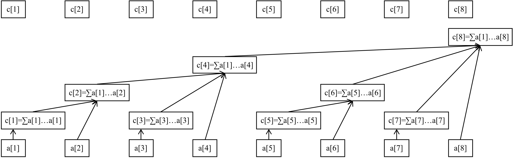

树状数组是用来实现单点查询，区间修改的数据结构，虽然功能上可以被线段树完全覆盖，但是容易实现．

>[!note]- P3374 【模板】树状数组 1
> ### 题目描述
>
> 如题，已知一个数列，你需要进行下面两种操作：
>
> - 将某一个数加上 $x$；
> - 求出某区间每一个数的和．
> 
> ### 输入格式
>
> 第一行包含两个正整数 $n,m$，分别表示该数列数字的个数和操作的总个数．
>
> 第二行包含 $n$ 个用空格分隔的整数，其中第 $i$ 个数字表示数列第 $i$ 项的初始值．
>
> 接下来 $m$ 行每行包含 $3$ 个整数，表示一个操作，具体如下：
>
> - `1 x k` 含义：将第 $x$ 个数加上 $k$；
> - `2 x y` 含义：输出区间 $[x,y]$ 内每个数的和．
> 
> ### 输出格式
>
> 输出包含若干行整数，即为所有操作 $2$ 的结果．
>
> ### 数据范围
> 
> 对于 $100\%$ 的数据，$1\le n,m \le 5\times 10^5$，$1\le x\le y\le n$，$-2^{31}\le k<2^{31}$．
>
> 数据保证对于任意时刻，$a$ 的任意子区间（包括长度为 $1$ 和 $n$ 的子区间）和均在 $[-2^{31}, 2^{31})$ 范围内．

# 基础树状数组

## 构造

我们让树状数组 `c` 的每一项 `c[i]` 都存储以 i 为最终位置，以 `lowbit(i)` 为长度的区间中所有数的和，即 `c[i]` 存储区间 $[i-lowbit(i)+1, i]$．

>[!note]- 什么是 `lowbit`
>
> `lowbit`，即低位，是指一个数的二进制从右起的第一个 1 和这个 1 右边的所有 0 所构成的新的二进制数．或者说是最右边的 1 所对应的权值．
>
> 如，$lowbit(12) = lowbit(1100_2)=100_2=4$

例如，一个 16 个元素的数组，其树状数组的管辖区间示意如下：（摘自 [oi-wiki](https://oi-wiki.org)）



如果写成二进制，更直观地：

令 $i$ 的二进制表示中，从右起第一个 `1` 位于第 $k$ 位（即 $lowbit(i) = 2^{k-1}$），则 $c[i]$ 管辖的区间由其本身 $i$ 和所有满足以下条件的正整数 $m$ 组成：

> $m$ 的二进制中，第 $k$ 位及比 $k$ 更高的所有位与 $i$ 对应相等，低于第 $k$ 位的部分可以是任意值．

例：对于 $i=88$，二进制为 `101 1000`，从右起第一个 `1` 在第 4 位．

因此 $c[88]$ 存储的数为所有形如 `101 xxxx` 但实际数值不超过 $88$ 的正整数——即固定高三位 `101`，低四位从 `0000` 变到 `1000`，对应区间 $[81, 88]$．

根据二进制知识可知，`lowbit(i) = i & -i`．

>[!note]- 为什么？
> 由于 `-i` 在计算机里是补码，等于 `~i + 1`（按位取反再加 1）．
>
> 这样操作后，若记 `i` 最右边的一个 1 为 $k$，由于取反，$k$ 右边的所有位都会变成 1，在加一后由于进位，再次变成 0．$k$ 在取反时变成 0，但由于进位变回 1．$k$ 左边的所有位都由于取反和原来不一样．这样，在按位与后，除了 $k$ 必然为 1 之外，其余的位必然都为 0．
>
> **例子**：
>
> `i = 6` → 二进制 `110`，`-i` 是 `010`（补码计算：`~110 = 001`，加 1 得 `010`）．
>
> `110 & 010 = 010` → 正是最右边的 1（二进制 `10`，即 2）．

## 查询操作

想要对区间 $[l, r]$ 查询，只需要知道区间 $[1,l-1]$ 和区间 $[1, r]$ 的和，之后用后者减去前者即可．

如何进行前缀查询呢？

例如，我想要查询区间 $[1, 7]$，先看 $c[7]$，能管辖 $[7,7]$，那 6 及之前的怎么办呢？$c[i]$ 肯定包含 $i$ 的，于是找到 $c[6]$，能管辖 $[5,6]$，同样的，那 4 及之前的怎么办呢，再看到 $c[4]$，能管辖 $[1,4]$，不剩了．

再例如，我想要查询区间 $[1, 5]$，先看 $c[5]$，能管辖 $[5,5]$，于是再找到 $c[4]$，能管辖 $[1,4]$，不剩了，故答案为 $c[4]+c[5]$．

一般的，我想要查询区间 $[1, n]$，先看 $c[n]$，发现 $c[n]$ 所能够管辖到的最小值为 $n-lowbit(n)+1$，在将 $c[n]$ 加和到 $ans$ 中后，原问题就转化为查询区间 $[1,n-lowbit(n)]$，边界条件是 $[1,0] = 0$．

时间复杂度 $O(\log n)$．

```cpp
// 查询区间[1,ed]
int query(int ed) {
	int ans = 0;
	for (int i = ed; i >= 1; i -= i & -i) {
		ans += c[i];
	}
	return ans;
}
// 查询区间[l,r]
int query(int l, int r) {
	return query(r) - query(l - 1);
}
```

## 修改操作

我们现在尝试修改序列的第 $i$ 项．

我们知道，树状数组是一棵树的形态，因此，修改一个元素，只需要更新记录这个元素的节点即可．

通过观察上图，所有被影响的节点会组成一条链的形状，且对于节点 $a[i]$，最底端（即下标最小）的节点为 $c[i]$．只需要找出 $c[i]$ 及所有的祖先节点，将它们都同步进行更改即可．

注意到，节点 $c[i]$ 的父节点总是 $c[i+lowbit(i)]$．（节点 $c[i]$ 的父节点为 $i$ 最小的、真包含 $c[i]$ 的节点）

因此，得出修改操作的一般步骤：

1. 令 $k$ 初始化为 $i$
2. 修改 $c[k]$
3. 将 $k$ 设定为 $k+lowbit(k)$，若 $k\leq n$，回到步骤 2

时间复杂度 $O(\log n)$．

```cpp
void add(int t, int k) {
	for (int i = t; i <= n; i += i & -i) {
		c[i] += k;
	}
}
```

## 建树

一般来说，建树只需要转化为 $n$ 次单点增加就可以了．时间复杂度 $O(n\log n)$．

但是有没有 $O(n)$ 建树的方法呢？

前面提到，$c[i] = sum\{a_i | i \in [i-lowbit(i)+1, i]\}$，可以使用前缀和优化．

```cpp
for (int i = 1; i <= n; i++) {
	cin >> a[i];
	sum[i] = sum[i - 1] + a[i];
}
for (int i = 1; i <= n; i++) {
	c[i] = sum[i] - sum[i - (i & -i)];
}
```

## 标程

```cpp
#include <bits/stdc++.h>
using namespace std;

const int N = 5e5 + 100;

int n, m, c[N], a[N], sum[N];

class Tree {
public:
	int query(int ed) {
		int ans = 0;
		for (int i = ed; i >= 1; i -= i & -i) {
			ans += c[i];
		}
		return ans;
	}
	int query(int l, int r) {
		return query(r) - query(l - 1);
	}
	void add(int t, int k) {
		for (int i = t; i <= n; i += i & -i) {
			c[i] += k;
		}
	}
};

int main() {
	cin >> n >> m;
	Tree tree;
	for (int i = 1; i <= n; i++) {
		cin >> a[i];
		sum[i] = sum[i - 1] + a[i];
	}
	for (int i = 1; i <= n; i++) {
		c[i] = sum[i] - sum[i - (i & -i)];
	}
	for (int i = 1; i <= m; i++) {
		int op, x, k;
		cin >> op >> x >> k;
		if (op == 1)
			tree.add(x, k);
		else
			cout << tree.query(x, k) << endl;
	}
	return 0;
}
```

# 树状数组变体

如果需要单点查询，区间修改，又该怎么做呢？

>[!note]- P3368 【模板】树状数组 2
> ### 题目描述
>
> 如题，已知一个数列，你需要进行下面两种操作：
>
> 1. 将某区间每一个数加上 $x$；
> 
> 2. 求出某一个数的值．
> 
> ### 输入格式
>
> 第一行包含两个整数 $N$、$M$，分别表示该数列数字的个数和操作的总个数．
>
> 第二行包含 $N$ 个用空格分隔的整数，其中第 $i$ 个数字表示数列第 $i $ 项的初始值．
>
> 接下来 $M$ 行每行包含 $2$ 或 $4$ 个整数，表示一个操作，具体如下：
>
> 操作 $1$： 格式：`1 x y k` 含义：将区间 $[x,y]$ 内每个数加上 $k$；
>
> 操作 $2$： 格式：`2 x` 含义：输出第 $x$ 个数的值．
>
> ### 输出格式
>
> 输出包含若干行整数，即为所有操作 $2$ 的结果．
>
> ### 数据范围
> 
> 对于 $100\%$ 的数据：$1 \leq N, M\le 5\times10^5$，$1 \leq x, y \leq n$，保证任意时刻序列中任意元素的绝对值都不大于 $2^{30}$．

很简单，只要使用差分来维护就可以了．

树状数组的主体不用改变，在建树时，由维护数组值改为维护差分值．

```cpp
for (int i = 1; i <= n; i++) {
	cin >> a[i];
	tree.add(i, a[i] - a[i - 1]);
}
```

对于查询第 $x$ 项，等同于区间查询差分数组 $[1, x]$．

```cpp
cin >> x;
cout << tree.query(1, x) << endl;
```

对于区间修改，设第 $k_1$ 到 $k_2$ 项增加 $x$，等同于 $c[k_1]$ 增加 $x$，$c[k_2+1]$ 减少 $x$．

```cpp
cin >> x >> y >> k;
tree.add(x, k);
tree.add(y + 1, -k);
```

## 标程

```cpp
#include <bits/stdc++.h>
using namespace std;

const int N = 5e5 + 100;

int n, m, c[N], a[N], sum[N];

class Tree {
public:
	int query(int ed) {
		int ans = 0;
		for (int i = ed; i >= 1; i -= i & -i) {
			ans += c[i];
		}
		return ans;
	}
	int query(int l, int r) {
		return query(r) - query(l - 1);
	}
	void add(int t, int k) {
		for (int i = t; i <= n; i += i & -i) {
			c[i] += k;
		}
	}
};

int main() {
	cin >> n >> m;
	Tree tree;
	for (int i = 1; i <= n; i++) {
		cin >> a[i];
		tree.add(i, a[i] - a[i - 1]);
	}
	for (int i = 1; i <= m; i++) {
		int op, x, y, k;
		cin >> op;
		if (op == 1) {
			cin >> x >> y >> k;
			tree.add(x, k);
			tree.add(y + 1, -k);
		}
		else {
			cin >> x;
			cout << tree.query(1, x) << endl;
		}
	}
	return 0;
}
```
