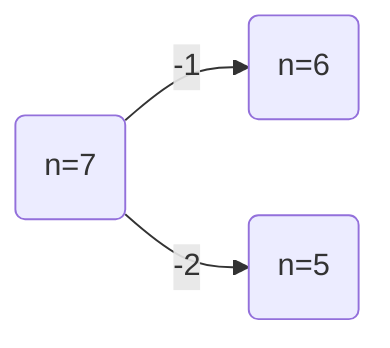
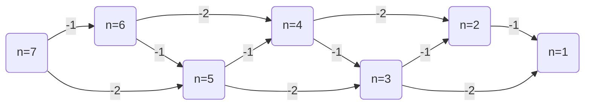
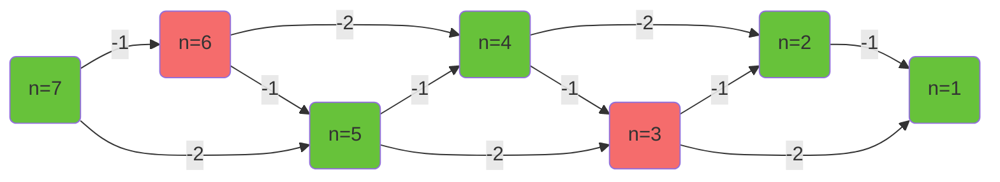
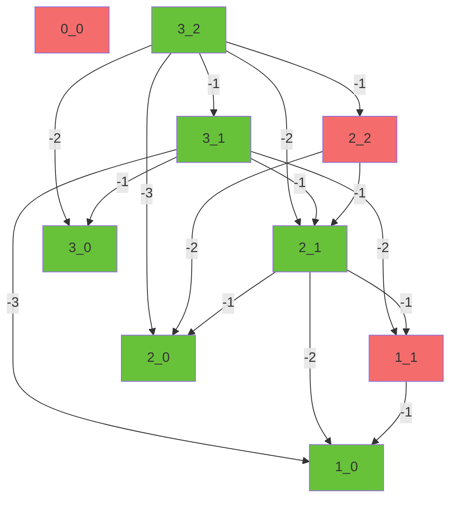

# 什么是博弈论

博弈论，即组合博弈，指一种游戏，这种游戏一般有以下性质：

1. 两人游戏，且轮流行动
2. 对等、完全
	 双方得知信息对等，双方可以进行的行动完全相同．
3. 确定性
	 游戏没有随机性的变量（如骰子、随机数等）
4. 无平局
5. 有限性
	 游戏无法无限继续，最终在一定时间内一定有一名玩家胜利，一名玩家失败．

# 相关定义

- 博弈论：研究**绝对理性**决策者之间战略互动的数学模型．
- $\color{green}{\mathcal{N}}$ 必胜态（Next player wins）：**至少存在**一种可能使得对方处于 $\color{red}{\mathcal{P}}$ 的一种游戏状态被称为必胜态．
- $\color{red}{\mathcal{P}}$ 必败态（Previous player wins）：**存在任意**一种方法让对方处于 $\color{green}{\mathcal{N}}$ 的一种游戏状态被称为必败态．
- 终局：处于终局时，有且仅有一名玩家获得立即胜利．
	 如 FPS 游戏中，仅剩 1 名玩家存活就是一个终局．

# 解决博弈论的一般步骤

1. 明确终局
2. 进行倒推
3. 寻找规律
4. 进行数学证明（可以省略）

# 典例：

## 巴什博弈

考虑总共有 $n$ 个物品，两名玩家，每次玩家必须至少取 $1$ 个，最多取 $m$ 个．最后一个物品十分值钱，取到最后一个物品的玩家获胜．

首先，检查这是不是博弈论：

| 项目         | 结果                         |
| ---------- | -------------------------- |
| 两人游戏，且轮流行动 | 符合，是两个人轮流行动                |
| 对等、完全      | 符合，每个人只能拿物品，且所有人都知道当前有多少物品 |
| 确定性        | 符合，没有随机因素                  |
| 无平局        | 符合，取到最后一个物品的玩家获胜，不会出现平局    |
| 有限性        | 符合，每次玩家必须至少取 1 个，不会出现取不完   |

所以下定结论，这是博弈论．

**明确终局**

很显然，终局是场上只剩下一个物品时，此时先手玩家 $\color{green}{\mathcal{N}}$．

**进行倒推**

我们尝试推演当 $m=2$ 时的情景，其中，红色节点表示先手玩家 $\color{red}{\mathcal{P}}$，绿色节点代表先手玩家 $\color{green}{\mathcal{N}}$．

先选定一个起始节点，起始节点不宜太大，太大则会难于分析，需要选取适中的起始节点．在这里，选择起始节点 $n=7$．

尝试分析起始节点的胜负性．

首先，列举其所有可能的游戏发展子状态．例：$n=7$ 的子状态是 $n=6$（拿一个） 和 $n=5$（拿两个）



再列举起始节点所有可能的 游戏发展子状态（这里指 $n\in \{5,6\}$）的游戏发展子状态，一直下去，知道抵达终局（这里指 $n=1$）．

列举完之后如下图：



最后，给每一个节点染色．若处于当前状态时先手玩家 $\color{red}{\mathcal{P}}$ 则将其染成红色，先手玩家 $\color{green}{\mathcal{N}}$ 则将其染成绿色．

染色规则如下：

- 终局节点根据游戏规则染色（此题中为 $\color{green}{\mathcal{N}}$）
- 若一个节点其所有子节点全为 $\color{green}{\mathcal{N}}$，则该节点为 $\color{red}{\mathcal{P}}$，否则该节点为 $\color{green}{\mathcal{N}}$．

染色完如下：



列下表：

| m   | n   | 局势                           |
| --- | --- | ---------------------------- |
| 2   | 1   | $\color{green}{\mathcal{N}}$ |
| 2   | 2   | $\color{green}{\mathcal{N}}$ |
| 2   | 3   | $\color{red}{\mathcal{P}}$   |
| 2   | 4   | $\color{green}{\mathcal{N}}$ |
| 2   | 5   | $\color{green}{\mathcal{N}}$ |
| 2   | 6   | $\color{red}{\mathcal{P}}$   |
| 2   | 7   | $\color{green}{\mathcal{N}}$ |

不难发现，当 $m=2$ 时，对于所有的 $n$，当且仅当 $3 \mid n$（$n$ 被 3 整除）时先手是 $\color{red}{\mathcal{P}}$ 的，此外，先手都是 $\color{green}{\mathcal{N}}$ 的．

**数学证明**

设整数 $k$ 满足 $k= n \bmod 3$，当 $k \in \{1,2\}$ 时，只需要拿取 $k$ 个，就可以转换为 $k=0$ 的情况，从而先手玩家 $\color{red}{\mathcal{P}}$．当 $k=0$ 时，无论拿 1 个还是 2 个，都会转化为 $k \in \{1,2\}$ 的形式，从而先手玩家必败．

推广到 $m \neq 2$ 的情况：当 $(m+1) \mid n$ 时，先手是 $\color{red}{\mathcal{P}}$ 的，此外的所有情况，先手都是 $\color{green}{\mathcal{N}}$ 的．

## Nim 游戏

>[!note]- P2197 Nim 游戏
>甲，乙两个人玩 Nim 取石子游戏．
>
>Nim 游戏的规则是这样的：地上有 n 堆石子，每人每次可从任意一堆石子里取出任意多枚石子扔掉，可以取完，不能不取．每次只能从一堆里取．最后没石子可取的人就输了．假如甲是先手，且告诉你这 n 堆石子的数量，他想知道是否存在先手必胜的策略．

显然，这是博弈论．

终局条件是场上没有物品时，此时先手玩家 $\color{red}{\mathcal{P}}$．

**进行倒推**

当 $n=1$ 时，先手玩家只要把这一堆石子取走就可以．故此时，先手玩家 $\color{green}{\mathcal{N}}$．

当 $n=2$ 时，为了方便表示，将 `x_y` 表示为第一堆剩下 `x` 个，第二堆剩下 `y` 个的情况．$x\geq y$

显然，当有一堆时 0 时，先手玩家可以直接拿走那一堆，故此时，先手玩家 $\color{green}{\mathcal{N}}$．

选取 `3_2` 为初始节点，列表：



好像当且仅当 $x=y$ 时为 $\color{red}{\mathcal{P}}$，其他时候都是 $\color{green}{\mathcal{N}}$．

证明也很简单，所有非 $x=y$ 的状态都可以一步转化为 $x=y$ 这个 $\color{red}{\mathcal{P}}$ 的状态．

那么，如何推广呢？

### Nim 和

定义一组数 $a_1,a_2,a_3,\cdots, a_n$ 的 **Nim 和**为 $a_1\oplus a_2\oplus\cdots\oplus a_n$

>[!info]+ 异或运算 $\oplus$
>异或是一种逻辑运算符，其法则为相同为 0，不同为 1，异或可以视为不进位加法运算．
>
>其真值表如下：
>
>|$A$|$B$|$A\oplus B$|
>|----|----|----|
>|0|0|0|
>|0|1|1|
>|1|0|1|
>|1|1|0|
>
>对于两个数之间的异或运算，需要将它们转化为二进制之后对每一位进行异或．
>
>计算：$5\oplus 3$
>
>$$
>\begin{aligned}
>5\oplus 3
>&=(101)_2 \oplus (11)_2\\
>&=(110)_2\\
>&=6\\
>\end{aligned}
>$$
>
>除了交换律、结合律外，异或还拥有一些性质：
>- 异或具有自反性：$k\oplus a \oplus a = k$
>- 异或拥有恒等律：$k\oplus 0 = k$

那么，当一个状态满足其 **Nim 和**为 0 是，当前状态为 $\color{red}{\mathcal{P}}$．

>[!info]- 证明
> 把每堆石子数写成二进制（比如 3 写成 `11`，5 写成 `101`），然后靠右对齐每一位，数一下这一位上一共有几个 1．
>
> 如果每一位上 1 的个数都是偶数，定义这个状态为“平衡”（Nim 和为 0）．如果至少有一位上 1 的个数是奇数，定义这个状态为“不平衡”（Nim 和不为 0）．
>
> 举个例子：两堆，3 和 5
>
> - 3 → `011`
> - 5 → `101`
> 
> 对齐（假设三位）：
>
> - 第 0 位（最右）：3 有 1，5 有 1 → 共 2 个 1（偶数）
> - 第 1 位：3 有 1，5 有 0 → 共 1 个 1（奇数）
> - 第 2 位：3 有 0，5 有 1 → 共 1 个 1（奇数）
> 
> 所以不平衡（Nim 和不为 0）．
>
> 如果两堆都是 3：
>
> - 3 → `011`
> - 3 → `011`
> 
> 每位 1 的个数：
> - 第 0 位 2 个（偶）
> - 第 1 位 2 个（偶）
> - 第 2 位 0 个（偶）→ 平衡（Nim 和为 0）．
> 
> 对于这个平衡状态，有两条性质：
>
> **性质 1：从平衡状态出发，无论你如何操作，只要操作是合法的，一定会变成不平衡状态．**
>
> 为什么？因为你想保持平衡，就得让每一堆的每一二进制位上的 1 的个数都还是偶数．但当你只改一堆时，那堆的某些位从 1 变 0 或 0 变 1，必然导致至少一位上 1 的个数从偶数变成奇数．所以**平衡 → 不平衡**是必然的．
>
> **性质 2：从不平衡状态出发，总有一种拿法，让它变回平衡状态．**
>
> 怎么找？找出二进制中“最高那位出现奇数个 1 的位”（如在两堆分别是 3 和 5 时，是右起第三位），然后选一堆在那一位上是 1 的，从这堆里拿走恰好能让所有位都变偶数的石子数．这个操作一定可行（因为那堆原来的石子数足够多）．所以**不平衡 → 平衡**是可以做到的．
>
>
> 终局时所有堆都是 0，写出来全是 0，每一位上 1 的个数都是 0（偶数），所以终局是**平衡状态**．
>
> 而且谁面对终局谁就输了（因为没石子可拿）．
>
> 因此，假设开局是平衡状态（Nim 和为 0）．先手只能把它变成不平衡（性质 1）．后手面对不平衡，可以把它变回平衡（性质 2）．如此循环：平衡→不平衡→平衡→不平衡……因为终局是平衡状态，所以最后一定是**后手**把局面变成终局（平衡），然后轮到先手时无石子可拿，先手输．
>
> 如果开局是不平衡状态，先手第一步就可以把它变成平衡，然后自己扮演上面“后手”的角色，最终让对手面对终局，所以先手赢．

由以上证明可以推导出博弈论证明的基本方法：

1. 明确一个必输终局有的性质，记之为 $R$.
2. 对于 $R$，如果所有操作都能破环性质 $R$，且所有不符合性质 $R$ 的局面都至少有 1 种操作能使局面具有 $R$ 性质．那么 $R$ 就是所有必输局面的共同性质．

### 阶梯 Nim

>[!note] 题目简介
>共有 $n$ 堆石子，第 $i$ 堆有 $a_i$ 枚石子．两名玩家轮流操作，每次操作中，要么取走第 1 堆石子中的任意多枚，要么将第 $i > 1$ 堆石子中的任意多枚移动到第 $i-1$ 堆，但不能不做任何操作．取走最后一枚石子的玩家取胜．

在问题中，处于偶数堆的石子可以视为不存在，因为当先手将偶数堆的石子向下移移到奇数堆，后手可以再将这些石子再向下又移到偶数堆．直到从第 1 堆拿走．

因此，影响战局的只会是奇数堆．再次观察，每一次移动奇数堆的石子，都会使其移动到偶数堆上，又因为偶数堆上的石子可以视为没有，所以，每一次移动奇数堆上棋子到偶数堆，等同于将这些石子移出游戏．这样，阶梯 Nim 游戏就相当于以每一个奇数堆为一个有效堆的 Nim 游戏．

# SG 函数

定义一个局面 $x$ 的 **SG 值** 为 $sg(x)$，则有

$$
sg(x) = mex\{sg(a_i) \mid a_i \rightarrow x\}
$$

，其中，$a_i\rightarrow x$ 的意思是能从局面 $a_i$ 通过一次合法的操作转换为 $x$．

>[!note] mex
>mex 指对于一个序列，最小的、不在这个序列中的自然数．
>
>如 $mex\{0,1,3,4\}=2$，因为 2 不在其中，且 2 是最小的不在其中的数。

因此，不难得出，当 $sg(x) = 0$，则局面 $x$ 先手必败，否则先手必胜．

举个例子，就拿巴氏博弈（$m=2$）来说，可列下表：

| $x$ | $a_i$         | $sg(a_i)$     | $sg(x)$ | 先手局势                         |
| --- | ------------- | ------------- | ------- | ---------------------------- |
| 0   | $\varnothing$ | $\varnothing$ | 0       | $\color{red}{\mathcal{P}}$   |
| 1   | $\{0\}$       | $\{0\}$       | 1       | $\color{green}{\mathcal{N}}$ |
| 2   | $\{0,1\}$     | $\{0,1\}$     | 2       | $\color{green}{\mathcal{N}}$ |
| 3   | $\{1,2\}$     | $\{1,2\}$     | 0       | $\color{red}{\mathcal{P}}$   |
| 4   | $\{2,3\}$     | $\{2,0\}$     | 1       | $\color{green}{\mathcal{N}}$ |
| 5   | $\{3,4\}$     | $\{0,1\}$     | 2       | $\color{green}{\mathcal{N}}$ |
| 6   | $\{4,5\}$     | $\{1,2\}$     | 0       | $\color{red}{\mathcal{P}}$   |

对于多个相对独立的游戏同时进行（例如：考虑总共 $n$ 堆物品，每堆有 $a_i$ 个物品，两名玩家，每次玩家必须至少取 $1$ 个，最多取 $m$ 个，且不能跨堆取．最终，无法操作的玩家落败．这是多个巴士博弈的游戏同时进行．），则总游戏的 SG 值与其分游戏的 SG 值有如下关系：

$$
sg(a_1, a_2, \cdots, a_n) = sg(a_1) \oplus sg(a_2) \oplus \cdots \oplus sg(a_n)
$$

Nim 游戏就是一个典型的多个相对独立的游戏同时进行的游戏，以下是每个独立游戏，即为单堆石子可列表格：

| $x$           | $a_i$                | $sg(a_i)$            | $sg(x)$ | 先手局势                         |
| ------------- | -------------------- | -------------------- | ------- | ---------------------------- |
| 0             | $\varnothing$        | $\varnothing$        | 0       | $\color{red}{\mathcal{P}}$   |
| 1             | $\{0\}$              | $\{0\}$              | 1       | $\color{green}{\mathcal{N}}$ |
| 2             | $\{0,1\}$            | $\{0,1\}$            | 2       | $\color{green}{\mathcal{N}}$ |
| 3             | $\{0,1,2\}$          | $\{0,1,2\}$          | 3       | $\color{green}{\mathcal{N}}$ |
| 4             | $\{0,1,2,3\}$        | $\{0,1,2,3\}$        | 4       | $\color{green}{\mathcal{N}}$ |
| 5             | $\{0,1,2,3,4\}$      | $\{0,1,2,3,4\}$      | 5       | $\color{green}{\mathcal{N}}$ |
| $n\mid n > 0$ | $\{0,1,\cdots,n-1\}$ | $\{0,1,\cdots,n-1\}$ | $n$     | $\color{green}{\mathcal{N}}$ |

因此，对于一个具有 $n$ 堆石子，第 $i$ 堆有 $a_i$ 个的 Nim 游戏，整体游戏的 SG 值如下：

$$
sg(a_i\mid 1\leq i\leq n) = a_1 \oplus a_2\oplus\cdots\oplus a_n
$$

不难发现，Nim 游戏的 SG 值就等于其 Nim 和，则从侧面证明了 Nim 游戏策略的正确性．

# 解决博弈论问题的一般策略

了解了 SG 函数，接下来就可以总结博弈论问题的一般策略．

1. 理解题意，提炼出博弈论模型．
2. 根据规则，手推或者计算机打表求出一些小数据的 SG 值．
3. 寻找规律．
4. 根据规律编程解决问题．

>[!note]- P4018 Roy&October 之取石子
> ### 题目描述
>
> Roy 和 October 两人在玩一个取石子的游戏．共有 $n$ 个石子，两人每次都只能取 $p^k$ 个（ $p$ 为质数，$k$ 为自然数，且 $p^k$ 小于等于当前剩余石子数），谁取走最后一个石子，谁就赢了．
>
> 现在 October 先取，问她有没有必胜策略．
>
> 若她有必胜策略，输出一行 `October wins!`；否则输出一行 `Roy wins!`．
>
> ### 输入格式
>
> 第一行一个正整数 $T$，表示测试点组数．
>
> 第 $2$ 行 $\sim$ 第 $T+1$ 行，一行一个正整数 $n$，表示石子个数．
>
> ### 输出格式
>
> $T$ 行，每行分别为 `October wins!` 或 `Roy wins!`．
>
> 对于 $100\%$ 的数据，$1\leq n\leq 5\times 10^7$, $1\leq T\leq 10^5$．

博弈论模型不难提炼．根据规则，可以写出如下的打表程序：

```cpp
#include <bits/stdc++.h>
using namespace std;

int n, sg[10000];
vector<int> prime;

int cal_sg(int n) {
	if (n == 0) return 0;
	if (sg[n] != -1) return sg[n];
	set<int> s;
	s.insert(cal_sg(n - 1));
	for (auto pr : prime) {
		int now = pr;
		while (now <= n) {
			s.insert(cal_sg(n - now));
			now *= pr;
		}
	}
	for (int i = 0; ; i++) {
		if (s.find(i) == s.end()) {
			sg[n] = i;
			return i;
		}
	}
}

int main() {
	memset(sg, -1, sizeof(sg));
	// 预处理质数
	for (int i = 2; i <= 100000; i++) {
		bool is_prime = true;
		for (int j = 2; j <= sqrt(i); j++) {
			if (i % j == 0)
				is_prime = false;
		}
		if (is_prime) {
			prime.push_back(i);
		}
	}

	for (int i = 1; i <= 100; i++) {
		if (cal_sg(i) == 0)
			cout << i << " ";
	}
	return 0;
}
```

在这里，由于只有 1 个独立游戏，因此，我们只关心 SG 值是否为 0．在这里，我打印出了所有 SG 值为 0 的情况．

输出如下：

```
6 12 18 24 30 36 42 48 54 60 66 72 78 84 90 96
```

不难发现，某一局面的 SG 值为 0 当且仅当 $n$ 是 6 的倍数．

因此，可以编写程序：

```cpp
#include <bits/stdc++.h>
using namespace std;

int main() {
	int T;
	cin >> T;
	while (T--) {
		int n;
		cin >> n;
		if (n % 6 == 0)
			cout << "Roy wins!" << endl;
		else
			cout << "October wins!" << endl;
	}
	return 0;
}
```
