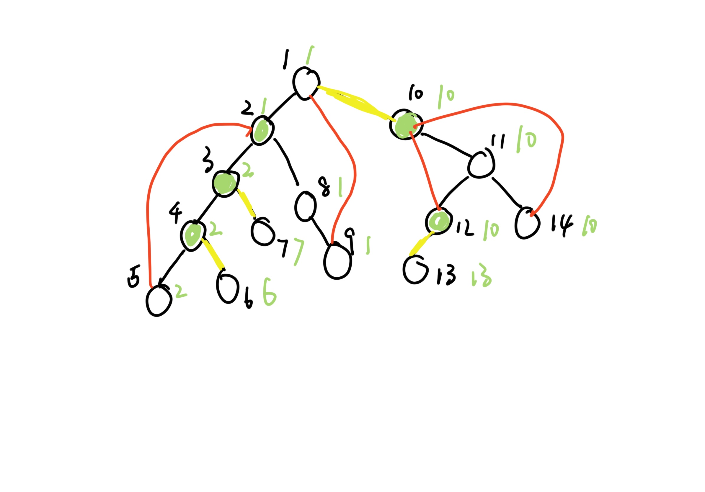
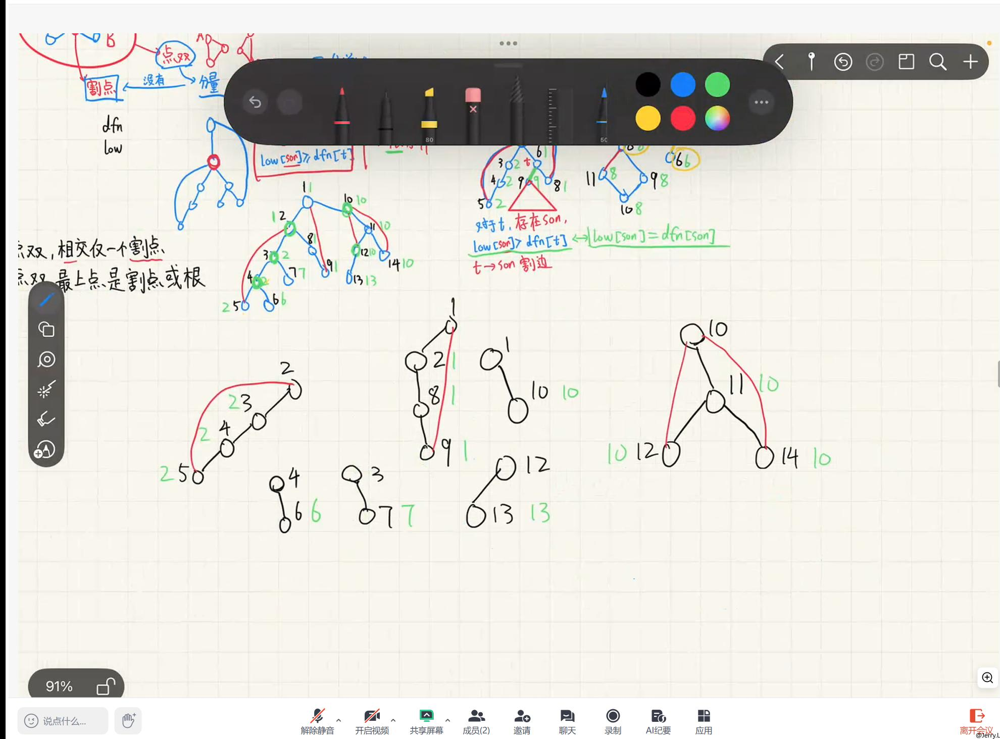

前置：强连通分量

# 定义

假定我们有一张图，其 dfs 生成树是像下面这样的：

对于无向图的 dfs 生成树，不存在一条横插边连接根节点两边（所有的横插边会转换为树边，然后等数量的树边回转换为返祖边），由于没有方向，所以前向边和返祖边是一样的，暂且认为他们都是返祖边．因此，在这棵生成树中，只存在树边（图中黑边）和返祖边（图中红边）．

在上图中，我们已经求出了每个结点的 `dfn`（黑色数字，也为节点编号）和 `last`（绿色数字）．

在无向图中，双连通分量分为两种：

- **边双连通分量（边双）**：如果说删除任意一条边后，点 $u$ 和点 $v$ 仍能连通，那么，点 $u$ 和点 $v$ 边双连通．（如上图中的点 1，2，3，4，5，8，9）
- **点双连通分量（点双）**：如果说删除任意一个点及其邻边后，点 $u$ 和点 $v$ 仍能连通，那么，点 $u$ 和点 $v$ 点双连通（如上图中的 1，2，8，9）

对于一个无向图中**极大**的双连通子图，我们称这个子图为一个双连通分量．

边双具有**传递性**：即 AC 边双，BC 边双，则 AC 肯定边双

而点双没有这种性质

- **桥（割边）**：满足一条桥被删除后，原图被分成两块（图中的黄边为桥）
- **割点**：满足一个割点及其邻边被删除后，原图被分成两块（图中的绿点为割点）

# 边双连通分量

对于一个点 $t$，如果有子节点 $son$ ，满足 $son$ 只能通过树边到达 $t$，那就代表 $son$ 和 $t$ 之间只存在一条树边，因此，这条边就是割边．

$son$ 只能通过树边到达 $t$，也就是说 $low_{son} \gt dfn_t$，由于 $son$ 是 $t$ 的子节点，所以，在 $son$ 能够到达的所有节点都是在以 $son$ 为根的子树之中，在这些节点中，$son$ 自身的 $dfn$ 值是最小的，因此又有 $low_{son} = dfn_{son}$

综上，对于一个点 $t$，如果有子节点 $son$，使得 $low_{son} = dfn_{son}$（即 $low_{son} \gt dfn_t$），那么从 $t$ 到 $son$ 的边就是一条割边．

如果边双之中有割边，那么删除了割边后，边双会被分成两块，这不满足边双的定义．影刺，不难得出，边双有一个重要的性质：**边双里一定没有割边．**

之后，使用 DFS 扫一遍就可以了．

# 点双连通分量

对于一个点 $t$（不是根节点），如果有子节点 $son$，使得节点 $son$ 如果不通过 $t$ 就无法达到 $t$ 的父节点 $u$，那么点 $t$ 就是一个割点．

节点 $son$ 如果不通过 $t$ 就无法达到 $t$ 的父节点，即 $low_{son} \geq dfn_t$

综上，对于一个点 $t$（不是根节点），如果有子节点 $son$，使得 $low_{son} \geq dfn_t$，那么点 $t$ 就是一个割点．

对于根节点，如果存在两条或以上的树边，则根节点是割点．

是不是像边双一样，点双里一定没有割点？

不！

点双有以下两个性质

- 性质一：不同点双，相交于仅一个割点（否则这两个点可以合成一个更大的点双）
- 性质二：一个点双，在 DFS 生成树上最上面的（即 `dfn` 最小的）点是割点或者是根

性质一证明：如果又两个点双子图，他们相交于两个割点，那么这两个点双子图可以合成一个更大的点双．

对于一个割点 $u$，如果其子节点 $v$ 有 `low[v]>=u`，则点 $u$，$v$ 和 $v$ 的子树中的待定节点（即不在其他点双的节点）是一组点双

以下是例图中所有的点双．

