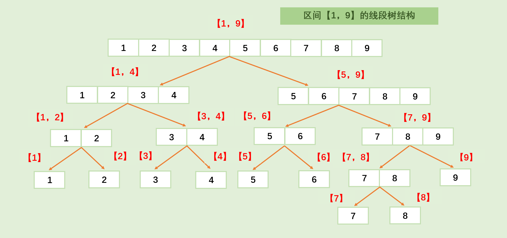

# 线段树的使用场景

线段树是一种常用来维护 **区间信息** 的数据结构

​可以在极快的时间内实现单点修改、区间修改、单点查询、区间查询（区间求和，求区间的最大值，求区间的最小值）等操作

线段树的时间复杂度为 $O(nlogn)$，但具有很大的常数，一般能够适用于 $10^6$ 数据规模的题。

线段树的空间复杂度为 $O(n)$，但也具有很大的常数（一般大于 10）

# 基础线段树

>[!note]- 题目：P3372 线段树 1
>
> 如题，已知一个数列 $\{a_i\}$ 共 $n$ 项，你需要进行 $m$ 次下面两种操作：
>
> 1. 将某区间每一个数加上 $k$。
> 2. 求出某区间每一个数的和。
>
> 对于 $100\%$ 的数据：$1 \le n, m \le {10}^5$，$a_i,k$ 为正数，且任意时刻数列的和不超过 $2\times 10^{18}$。

## 思路

​如下图所示，线段树是建立在区间基础上的树，树的每个节点都代表着一段区间【L，R】，之后，在程序中维护每一个节点的信息。



将所有的节点从 $1$ 到 $2n-1$ 进行标号，则不难得出以下性质：

对于节点 $t$，设其区间为 $[l,r]$，定义 $mid = (l + r) \div 2$，则其子节点有两个，其一为节点 $2t$，其区间为 $[l, mid]$，其一为节点 $2t+1$，其区间为 $[mid+1, r]$，此外，当且仅当 $l = r$ 时，该节点为叶子节点，没有子节点。

## 代码实现

### 建树

首先，我们在建树的时候，可以考虑递归建树。

对于每一个节点，如果它是叶子节点，可以直接通过 `a` 数组设置基础信息，如果其下还有节点，则将该区间从中点处分割为两个子区间，并分别进入左右节点的递归建树，最后将两个子节点的信息 `pushup` 到父节点，即收集子节点的所有 `sum` 之和，来刷新父节点的元素和。

额外要注意的是，节点数组需要开至少 4 倍，由于线段树的二分特性，所以线段树的**有效节点**是 $2n-1$ ，但是，在下文的一些操作中，可能会访问到叶子节点的子节点，所以至少开 4 倍，这里建议开 8 倍，为了防止不必要的下标越界。

```cpp
const int N = 1e5 + 100;
int a[N];
int sum[N * 8], add[N * 8];
// sum[i]表示第i个节点内，所有数之和
// add[i]（标记）表示在第i个节点内，需要对每一个数增加的数量，需要注意的是，在add数组更改时，sum数组也会同步更改，实际上，add数组储存的是该节点的所有子节点所需要增加的数量
void build(int t, int l, int r)
{
	// 需要：使用a数组来初始化sum数组
	// 如是最底层，单个的，则直接赋值
	if (l == r)
	{
		sum[t] = a[l];
		return;
	}
	// 否则，使用递归来为sum赋值
	int mid = (l + r) / 2;
	build(2 * t, l, mid);
	build(2 * t + 1, mid + 1, r);
	// 下层节点的贡献汇入本节点
	pushup(t);
}
// 下层节点的贡献汇入本节点
void pushup(int t)
{
	sum[t] = sum[2 * t] + sum[2 * t + 1];
}
```

### 区间修改

对于一个节点 $t$，我们可以尝试实现一个函数，用于让该节点和目标区间重合的部分进行修改。在此题中，我们需要刷新第 $t$ 个节点，其起屹位置分别为 $l$ 和 $r$，使得区间 $[x,y] \cap [l,r]$ 中的每一个数增加 $k$

首先的首先，我们需要让节点 $t$ 没有向下处理的所有标记（即记录在 `add` 数组中的）都推到节点 $t$ 的两个子节点上，并且要让子节点根据 `add` 来更新 `sum`，这个操作叫做 `pushdown`。更加普遍的，`pushdown` 就是让一个节点的所有的**修改**标记都释放给子节点，并且为子结点结算所有受到影响的**查询**标记。一个节点的修改标记会在施加后立即对查询标记生效，千万不要重复生效。

如果节点 $t$ 完全包含在了目标区间中（也就是说，$[l,r]\subseteq[x,y]$，即满足 $l \geq x \land r \leq y$），我们就要对该节点的 `sum` 值进行修正，此节点的每一个值都要增加 $k$，则这个节点的 `sum` 值就要有几个数就加几个 $k$，即需要增加的值 $\Delta = k(r-l+1)$，按道理来说，我需要将节点 $t$ 的所有子节点都进行更改，但是先放一放，暂且记在 `add` 中，作为标记。

如果节点 $t$ 与目标区间毫不相干（也就是说，$[x,y] \cap [l,r] = \varnothing$，即满足 $l > y \lor r < x$），则无需做任何处理，直接 `return`。

否则，表示节点 $t$ 与目标区间有重合部分，也间接表明了节点 $t$ 不是叶子节点，则可以递归处理，最后再将两个子节点的信息 `pushup` 到父节点。

```cpp
void pushdown(int t, int l, int r)
{
	if (add[t])
	{
		// 处理add数组
		add[t * 2] += add[t];
		add[t * 2 + 1] += add[t];
		// 连带处理sum数组
		int mid = (l + r) / 2;
		sum[t * 2] += (mid - l + 1) * add[t];
		sum[t * 2 + 1] += (r - mid) * add[t];
		add[t] = 0;
	}
}
/// @brief 尝试在t=>(l, r)这个范围内为[x,y]增加k
void Modify(int t, int l, int r, int x, int y, int k)
{
	// 先清理干净
	pushdown(t, l, r);
	// 检查能否完全包含
	if (l >= x && r <= y)
	{
		add[t] += k;
		sum[t] += k * (r - l + 1);
		return;
	}
	// 检查是否毫不相干
	if (l > y || r < x)
	{
		return;
	}
	// 否则，尝试委托给子节点
	int mid = (l + r) / 2;
	Modify(t * 2, l, mid, x, y, k);
	Modify(t * 2 + 1, mid + 1, r, x, y, k);
	// 收获成果
	pushup(t);
}
```

### 区间查询

和修改很类似。

对于一个节点 $t$，我们可以尝试实现一个返回值为 `int` 的函数，用于让该节点和目标区间重合的部分进行修改。在此题中，我们需要查询第 $t$ 个节点，其起屹位置分别为 $l$ 和 $r$，获得区间 $[x,y] \cap [l,r]$ 中的每一个数增加 $k$

首先的首先，我们需要先进行一次 `pushdown`，将自己身上撇干净。

如果节点 $t$ 完全包含在了目标区间中，我们就需要返回该节点中的元素的和，即 `sum[t]`。

如果节点 $t$ 与目标区间毫不相干，则直接 `return 0`。

否则，表示节点 $t$ 与目标区间有重合部分，也间接表明了节点 $t$ 不是叶子节点，则可以递归处理，最后再将两个子节点的信息相加返回。

```cpp
/// @brief 尝试得到[l,r]和[x,y]之间的并集的元素之和
int Query(int t, int l, int r, int x, int y)
{
	// 先清理干净
	pushdown(t, l, r);
	// 检查能否完全包含
	if (l >= x && r <= y)
	{
		return sum[t];
	}
	// 检查是否毫不相干
	if (l > y || r < x)
	{
		return 0;
	}
	// 否则，尝试委托给子节点
	int mid = (l + r) / 2;
	return Query(t * 2, l, mid, x, y) + Query(t * 2 + 1, mid + 1, r, x, y);
}
```

## 标程

```cpp
#include <bits/stdc++.h>
using namespace std;

const int N = 1e5 + 100;

#define int long long

int n, m, a[N];
int sum[N * 8], add[N * 8];

class SegTree
{
private:
	// 初始化节点
	void build(int t, int l, int r)
	{
		// 需要：使用a数组来初始化sum数组
		// 如是最底层，单个的，则直接赋值
		if (l == r)
		{
			sum[t] = a[l];
			return;
		}
		// 否则，使用递归来为sum赋值
		int mid = (l + r) / 2;
		build(2 * t, l, mid);
		build(2 * t + 1, mid + 1, r);
		// 下层节点的贡献汇入本节点
		pushup(t);
	}
	// 下层节点的贡献汇入本节点
	void pushup(int t)
	{
		sum[t] = sum[2 * t] + sum[2 * t + 1];
	}
	// 将当前节点的add委派给子节点，调整子节点的add & sum
	void pushdown(int t, int l, int r)
	{
		if (add[t])
		{
			// 处理add数组
			add[t * 2] += add[t];
			add[t * 2 + 1] += add[t];
			// 连带处理sum数组
			int mid = (l + r) / 2;
			sum[t * 2] += (mid - l + 1) * add[t];
			sum[t * 2 + 1] += (r - mid) * add[t];
			add[t] = 0;
		}
	}

public:
	void Init()
	{
		build(1, 1, n);
	}
	/// @brief 尝试在t=>(l, r)这个范围内为[x,y]增加k
	void Modify(int t, int l, int r, int x, int y, int k)
	{
		// 先清理干净
		pushdown(t, l, r);
		// 检查能否完全包含
		if (l >= x && r <= y)
		{
			add[t] += k;
			sum[t] += k * (r - l + 1);
			return;
		}
		// 检查是否毫不相干
		if (l > y || r < x)
		{
			return;
		}
		// 否则，尝试委托给子节点
		int mid = (l + r) / 2;
		Modify(t * 2, l, mid, x, y, k);
		Modify(t * 2 + 1, mid + 1, r, x, y, k);
		// 收获成果
		pushup(t);
	}
	/// @brief 尝试得到[l,r]和[x,y]之间的并集的元素之和
	int Query(int t, int l, int r, int x, int y)
	{
		// 先清理干净
		pushdown(t, l, r);
		// 检查能否完全包含
		if (l >= x && r <= y)
		{
			return sum[t];
		}
		// 检查是否毫不相干
		if (l > y || r < x)
		{
			return 0;
		}
		// 否则，尝试委托给子节点
		int mid = (l + r) / 2;
		return Query(t * 2, l, mid, x, y) + Query(t * 2 + 1, mid + 1, r, x, y);
	}
};

signed main()
{
	cin >> n >> m;
	for (int i = 1; i <= n; i++)
		cin >> a[i];
	SegTree st;
	st.Init();
	for (int i = 1; i <= m; i++)
	{
		int op;
		cin >> op;
		if (op == 1)
		{
			int x, y, k;
			cin >> x >> y >> k;
			st.Modify(1, 1, n, x, y, k);
		}
		if (op == 2)
		{
			int x, y;
			cin >> x >> y;
			cout << st.Query(1, 1, n, x, y) << endl;
		}
	}
}
```

# 带有多种修改和查询操作的线段树

>[!note]- 题目：P3373 线段树 2
>已知一个数列 $n$ 个数，你需要进行 $q$ 次下面三种操作：
>
>- 将区间 $[x,y]$ 每一个数乘上 $k$；
>- 将区间 $[x,y]$ 每一个数加上 $k$；
>- 求出某区间每一个数的和对 $m$ 取模的结果。
>
>对于 $100\%$ 的数据：$1 \le n \le 10^5$，$1 \le q \le 10^5,1\le k\le 10^4,m = 571373$。

## 思路

对于多种查询的线段树，对每一种查询，给每一个节点设立一个对应的编辑，然后在 `pushup` 和 `pushdown` 中分别维护其添加、生效及移除即可。

对于多种改动的线段树，对每一种改动，先找出改动的优先级，然后再找到改动后对其余两种改动的影响。

就像此题，此题有两种改动，加法和乘法，如果对于某一个节点，其乘法标记增加了 $k$，那么其加法标记就会增加 $xk$，其中，$x$ 是原本就有的加法标记数量。

容易发现，乘法对加法的影响很容易确定，但是，如果对于某一个节点，其加法标记增加了 $k$，那么我们就很难确定其乘法标记增加多少。（也许是 $(x+k)\div k$，其中，$x$ 是原本就有的加法标记数量，但却大概率是个小数）

所以，我们在处理加法标记时，最好没有乘法标记（即乘法标记为 1），因此，乘法的优先级就大于加法。

与此同时，如果有一个操作“覆盖”，能进行区间的覆盖操作，那么很容易就可以知道，覆盖操作的优先级是大于乘法的。

因此，我们在 `pushup` 中只处理子节点提供给父节点的**查询**标记，而在 `pushdown` 中依照优先级处理父节点传递给子节点的所有标记及其影响，并清空父节点的标记。

对于此题，每一个节点都有 1 个**查询**标记 `sum` 和 2 个**修改**标记 `add` 与 `mul`。

## 标程

```cpp
#include <bits/stdc++.h>
using namespace std;
const int N = 1e5 + 10;
int n, q, m;
int a[N], sum[N * 8], add[N * 8], mul[N * 8];
// sum[i]表示第i个区间内，所有数之和
// add[i]（标记）表示在第i个区间内，需要对每一个数增加的数量，需要注意的是，在add数组更改时，sum数组也会同步更改，实际上，add数组储存的是该节点的所有子节点所需要增加的数量
// mul[i]（标记）与add类似，储存的是该节点的所有子节点所需要乘的倍数
// 此外，由于在访问左节点和右节点时，可能会访问到边界之外的值，所以，建议上述三个数组都要开8倍最大n的大小

// 定义一个类，用来表示线段树
class SegTree
{
private:
	/// @brief 通过t节点的所有子节点的sum值，将节点t的sum值进行刷新（收作业）
	/// @param t 目标节点
	/// @param l 节点t的左边界
	/// @param r 节点t的右边界
	void pushup(int t, int l, int r)
	{
		sum[t] = sum[t * 2] + sum[t * 2 + 1];
	}
	/// @brief 将t节点所有的标记都下放到其子节点，并在其子节点进行标记的结算
	/// @param t 目标节点
	/// @param l 节点t的左边界
	/// @param r 节点t的右边界
	void pushdown(int t, int l, int r)
	{
		// 由于mul[t]的默认值为1，所以不要写成以下代码
		// if (mul[t])
		if (mul[t] != 1) // 如果存在乘法标记
		{
			// 将乘法标记下放
			mul[t * 2] += mul[t];
			mul[t * 2 + 1] += mul[t];

			// 对应的，刷新add标记
			add[t * 2] *= mul[t];
			add[t * 2 + 1] *= mul[t];

			// 对应的，刷新sum标记
			sum[t * 2] *= mul[t];
			sum[t * 2 + 1] *= mul[t];

			// mul[t]恢复默认值
			mul[t] = 1;
		}

		if (add[t]) // 如果存在加法标记
		{
			// 将加法标记下放
			add[t * 2] += add[t];
			add[t * 2 + 1] += add[t];

			// 对应的，刷新sum标记
			int mid = (l + r) / 2;
			sum[t * 2] += add[t] * (mid - l + 1);
			sum[t * 2 + 1] += add[t] * (r - mid);

			// add标记恢复默认
			add[t] = 0;
		}
	}

public:
	/// @brief 构造一棵线段树的节点t
	/// @param t 目标节点
	/// @param l 节点t的左边界
	/// @param r 节点t的右边界
	void Build(int t, int l, int r)
	{
		// 标记恢复默认
		sum[t] = 0;
		add[t] = 0;
		mul[t] = 1;
		// 当节点t是底层节点时，记录sum值
		if (l == r)
		{
			sum[t] = a[l];
			return;
		}
		// 向下递归
		int mid = (l + r) / 2;
		Build(t * 2, l, mid);
		Build(t * 2 + 1, mid + 1, r);
		// 结算结果
		pushup(t, l, r);
	}

	/// @brief 对于节点t，在[x,y]的范围内增加k
	/// @param t 目标节点
	/// @param l 节点t的左边界
	/// @param r 节点t的右边界
	/// @param x 如brief
	/// @param y 如brief
	/// @param k 如brief
	void Add(int t, int l, int r, int x, int y, int k)
	{
		// 清空自己身上的标记
		pushdown(t, l, r);
		// 当节点t完全包含在[x,y]中时
		if (l >= x && r <= y)
		{
			// 对节点t进行add操作
			add[t] += k;
			sum[t] += k * (r - l + 1);
			return;
		}
		// 如果搭不上边，那么就不处理
		if (l > y || r < x)
		{
			return;
		}
		// 递归向下处理
		int mid = (l + r) / 2;
		Add(t * 2, l, mid, x, y, k);
		Add(t * 2 + 1, mid + 1, r, x, y, k);
		// 结算结果
		pushup(t, l, r);
	}

	/// @brief 对于节点t，在[x,y]的范围内的每个数都乘上k
	/// @param t 目标节点
	/// @param l 节点t的左边界
	/// @param r 节点t的右边界
	/// @param x 如brief
	/// @param y 如brief
	/// @param k 如brief
	void Mul(int t, int l, int r, int x, int y, int k)
	{
		// 清空自己身上的标记
		pushdown(t, l, r);
		// 当节点t完全包含在[x,y]中时
		if (l >= x && r <= y)
		{
			// 对节点t进行add操作
			mul[t] *= k;
			add[t] *= k; // 可省略
			sum[t] *= k;
			return;
		}
		// 如果搭不上边，那么就不处理
		if (l > y || r < x)
		{
			return;
		}
		// 递归向下处理
		int mid = (l + r) / 2;
		Mul(t * 2, l, mid, x, y, k);
		Mul(t * 2 + 1, mid + 1, r, x, y, k);
		// 结算结果
		pushup(t, l, r);
	}

	/// @brief 对于节点t，得到在[x,y]的范围内的每个数的和
	/// @param t 目标节点
	/// @param l 节点t的左边界
	/// @param r 节点t的右边界
	/// @param x 如brief
	/// @param y 如brief
	int Query(int t, int l, int r, int x, int y)
	{
		// 清空自己身上的标记
		pushdown(t, l, r);
		// 当节点t完全包含在[x,y]中时
		if (l >= x && r <= y)
		{
			// 计数
			return sum[t];
		}
		// 如果搭不上边，那么就记0
		if (l > y || r < x)
		{
			return 0;
		}
		// 递归向下处理
		int mid = (l + r) / 2;
		return Query(t * 2, l, mid, x, y) + Query(t * 2 + 1, mid + 1, r, x, y);
	}
};

int main()
{
	cin >> n >> q >> m;
	for (int i = 1; i <= n; i++)
	{
		cin >> a[i];
	}

	SegTree st;

	st.Build(1, 1, n);

	for (int i = 1; i <= q; i++)
	{
		int op;
		int x, y, k;
		cin >> op;
		switch (op)
		{
		case 1:
			cin >> x >> y >> k;
			st.Mul(1, 1, n, x, y, k);
			break;

		case 2:
			cin >> x >> y >> k;
			st.Add(1, 1, n, x, y, k);
			break;

		default:
			cin >> x >> y;
			cout << st.Query(1, 1, n, x, y) << endl;
			break;
		}
	}

	return 0;
}
```

# 复杂线段树——辅助标记的添加与应用

> [!note]- 题目：P2572 序列操作
> ### 题目描述
> 
> lxhgww 最近收到了一个 $01$ 序列，序列里面包含了 $n$ 个数，下标从 $0$ 开始。这些数要么是 $0$，要么是 $1$，现在对于这个序列有五种变换操作和询问操作：
> 
> - `0 l r` 把 $[l, r]$ 区间内的所有数全变成 $0$；
> - `1 l r` 把 $[l, r]$ 区间内的所有数全变成 $1$；
> - `2 l r` 把 $[l,r]$ 区间内的所有数全部取反，也就是说把所有的 $0$ 变成 $1$，把所有的 $1$ 变成 $0$；
> - `3 l r` 询问 $[l, r]$ 区间内总共有多少个 $1$；
> - `4 l r` 询问 $[l, r]$ 区间内最多有多少个连续的 $1$。
> 
> 对于每一种询问操作，lxhgww 都需要给出回答，聪明的程序员们，你们能帮助他吗？
> 
> ### 输入格式
> 
> 第一行两个正整数 $n,m$，表示序列长度与操作个数。
> 
> 第二行包括 $n$ 个数，表示序列的初始状态。
> 
> 接下来 $m$ 行，每行三个整数，表示一次操作。
> 
> ### 输出格式
> 
> 对于每一个询问操作，输出一行一个数，表示其对应的答案。
> 
> 对于 $100\%$ 的数据，$1\le n,m \le 10^5$。


我们想要实现对于每一种修改，每一种查询都能进行变化。

对于覆盖，两种查询都很好求，但对于取反，第二种查询就比较复杂。

首先，为了计算出区间内连续 1 的个数，我们需要知道其子区间**从左边开始数的连续的 1 的数量**`lv1` 以及**从右边开始数的连续的 1 的数量**`rv1`，那么，其区间内连续 1 的个数 `con1` 的转换公式为 $fa.con1 = max(left.con1, right.con1, left.rv1 + right.lv1)$，其中节点 $fa$ 的左右子节点分别为 $left$ 和 $right$ 。

但是，对于 `lv1` 和 `rv1`，甚至 `con1`，也很难知道其取反后的结果，所以，我们为这两个辅助标记再定义辅助标记，我们需要知道其子区间**从左边开始数的连续的 0 的数量**`lv0`、**从右边开始数的连续的 0 的数量**`rv0` 以及**区间内 0 的个数**`con0`，所以，对于一次取反操作，我们只需要分别交 `lv1` 和 `rv1`，`lv0` 和 `rv0`，`con1` 和 `con0` 就可以了。

对于这么多的标记，我们可以定义一个结构体来进行储存，并且重载 + 运算符来表示合并。

最后，我们只需要修改 `pushdown`、`pushup` 以及所有的改动函数来初始化和维护这些变量就可以了。

## 标程

```cpp
#include <bits/stdc++.h>

using namespace std;

const int N = 1e5 + 100;

struct Node
{
	// 修改标记（懒标记）
	bool rev;  // 是否取反
	int cover; // 覆盖成何值
	bool need; // 是否需要覆盖

	// 查询标记
	int sum;  // 记录当前区间内1的数量
	int len;  // 记录当前区间的长度
	int con1; // 记录当前最长的连续的一段1
	int con0; // 记录当前最长的连续的一段0
	int lv1;  // 记录从左边开始数的连续的1的数量
	int rv1;  // 记录从右边开始数的连续的1的数量
	int lv0;  // 记录从左边开始数的连续的0的数量
	int rv0;  // 记录从右边开始数的连续的0的数量
	friend Node operator+(Node a, Node b)
	{
		Node c;
		c.len = a.len + b.len;
		c.sum = a.sum + b.sum;
		c.con1 = max(max(a.con1, b.con1), a.rv1 + b.lv1);
		c.con0 = max(max(a.con0, b.con0), a.rv0 + b.lv0);
		c.lv1 = (a.sum == a.len) ? a.len + b.lv1 : a.lv1;
		c.lv0 = (a.sum == 0) ? a.len + b.lv0 : a.lv0;
		c.rv1 = (b.sum == b.len) ? b.len + a.rv1 : b.rv1;
		c.rv0 = (b.sum == 0) ? b.len + a.rv0 : b.rv0;
		return c;
	}
};

Node node[N * 4]; // 线段树节点数组，4倍空间足够维护区间

struct SegTree
{
	// pushup: 合并左右儿子的区间信息，更新父节点
	void pushup(int t, int l, int r)
	{
		// 先保存父节点的懒标记（need/cover/rev），再合并左右儿子的区间信息
		Node c = node[t];
		node[t] = node[t * 2] + node[t * 2 + 1]; // 区间合并
		node[t].need = c.need;
		node[t].cover = c.cover;
		node[t].rev = c.rev;
	}

	// hcover: 把节点t的区间全部赋成v（0或1），并设置懒标记
	void hcover(int t, int v)
	{
		node[t].need = true; // 标记该区间需要被覆盖
		node[t].cover = v;	 // 记录要覆盖成的值
		node[t].rev = 0;	 // 覆盖后不再需要取反
		// 直接更新区间信息
		node[t].sum = node[t].len * v;
		node[t].con1 = node[t].len * v;
		node[t].con0 = node[t].len * !v;
		node[t].lv1 = node[t].len * v;
		node[t].lv0 = node[t].len * !v;
		node[t].rv1 = node[t].len * v;
		node[t].rv0 = node[t].len * !v;
	}

	// hrev: 把节点t的区间全部取反，并设置懒标记
	void hrev(int t)
	{
		node[t].rev = !node[t].rev;				 // 取反标记异或
		node[t].sum = node[t].len - node[t].sum; // 1变0，0变1
		swap(node[t].con1, node[t].con0);		 // 连续1和连续0交换
		swap(node[t].lv1, node[t].lv0);
		swap(node[t].rv1, node[t].rv0);
	}

	// pushdown: 下传懒标记，将父节点的标记传递给左右儿子
	void pushdown(int t, int l, int r)
	{
		if (l == r)
			return; // 叶子节点无需下传
		// 如果有区间赋值标记，优先下传
		if (node[t].need)
		{
			hcover(t * 2, node[t].cover);
			hcover(t * 2 + 1, node[t].cover);
			node[t].need = false;
			node[t].cover = 0;
		}
		// 如果有区间取反标记，下传
		if (node[t].rev)
		{
			hrev(t * 2);
			hrev(t * 2 + 1);
			node[t].rev = 0;
		}
	}

	// Build: 建树，递归初始化每个节点的区间信息
	void Build(int t, int l, int r, int *v)
	{
		if (l == r)
		{
			// 叶子节点，直接赋值
			node[t].need = false;
			node[t].cover = 0;
			node[t].rev = 0;
			node[t].len = 1;
			node[t].sum = v[l];
			node[t].con1 = v[l];
			node[t].con0 = !v[l];
			node[t].lv1 = v[l];
			node[t].lv0 = !v[l];
			node[t].rv1 = v[l];
			node[t].rv0 = !v[l];
			return;
		}
		int mid = (l + r) / 2;
		Build(t * 2, l, mid, v);
		Build(t * 2 + 1, mid + 1, r, v);
		pushup(t, l, r);
	}

	// 区间赋值操作：将[x, y]区间全部赋成k（0或1）
	void Cover(int t, int l, int r, int x, int y, int k)
	{
		pushdown(t, l, r); // 递归前先下传懒标记
		if (x <= l && r <= y)
		{
			hcover(t, k); // 完全覆盖，直接赋值
			return;
		}
		if (y < l || r < x)
			return; // 无交集，直接返回
		int mid = (l + r) / 2;
		Cover(t * 2, l, mid, x, y, k);
		Cover(t * 2 + 1, mid + 1, r, x, y, k);
		pushup(t, l, r); // 回溯时合并区间信息
	}

	// 区间取反操作：将[x, y]区间全部取反
	void Rev(int t, int l, int r, int x, int y)
	{
		pushdown(t, l, r); // 递归前先下传懒标记
		if (x <= l && r <= y)
		{
			hrev(t); // 完全覆盖，直接取反
			return;
		}
		if (y < l || r < x)
			return; // 无交集，直接返回
		int mid = (l + r) / 2;
		Rev(t * 2, l, mid, x, y);
		Rev(t * 2 + 1, mid + 1, r, x, y);
		pushup(t, l, r); // 回溯时合并区间信息
	}

	// 区间查询：返回[x, y]区间的信息
	Node Query(int t, int l, int r, int x, int y)
	{
		pushdown(t, l, r); // 递归前先下传懒标记
		if (x <= l && r <= y)
			return node[t]; // 完全覆盖，直接返回
		int mid = (l + r) / 2;
		if (y <= mid)
			return Query(t * 2, l, mid, x, y); // 只在左子树
		if (x > mid)
			return Query(t * 2 + 1, mid + 1, r, x, y); // 只在右子树
		// 跨越左右子树，合并结果
		Node q1 = Query(t * 2, l, mid, x, y);
		Node q2 = Query(t * 2 + 1, mid + 1, r, x, y);
		return q1 + q2;
	}
};

int a[N];

// 此处的read()是快读函数，可以极快速的读入一个整数
int read()
{
	int s = 0, c = getchar(), a = 0;
	while (!isdigit(c))
		s |= c == '-', c = getchar();
	while (isdigit(c))
		a = a * 10 + c - '0', c = getchar();
	return s ? -a : a;
}

int main()
{
	int n, m;
	// 读入序列长度n和操作次数m
	n = read(), m = read();
	SegTree tree;
	// 读入初始01序列，下标从1开始，a[1]~a[n]
	for (int i = 1; i <= n; ++i)
		a[i] = read();
	// 建树，根节点编号为1，维护区间[1, n]的信息
	tree.Build(1, 1, n, a);
	// 依次处理m个操作
	for (int i = 1; i <= m; ++i)
	{
		int op, l, r;
		// 读入操作类型op和区间[l, r]，题目输入下标从0开始，这里+1转为1开始
		op = read(), l = read() + 1, r = read() + 1;
		if (op == 0)
			// 区间[l, r]赋值为0
			tree.Cover(1, 1, n, l, r, 0);
		if (op == 1)
			// 区间[l, r]赋值为1
			tree.Cover(1, 1, n, l, r, 1);
		if (op == 2)
			// 区间[l, r]取反
			tree.Rev(1, 1, n, l, r);
		if (op == 3)
		{
			// 查询区间[l, r]内1的个数，输出结果
			Node res = tree.Query(1, 1, n, l, r);
			cout << res.sum << endl;
		}
		if (op == 4)
		{
			// 查询区间[l, r]内最长连续1的长度，输出结果
			Node res = tree.Query(1, 1, n, l, r);
			cout << res.con1 << endl;
		}
	}
	return 0;
}
```
