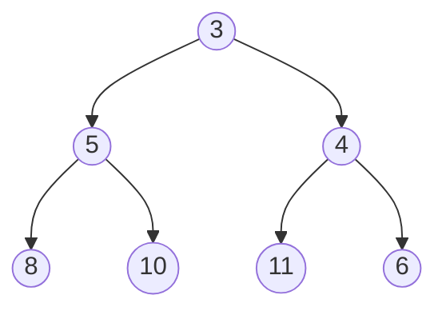
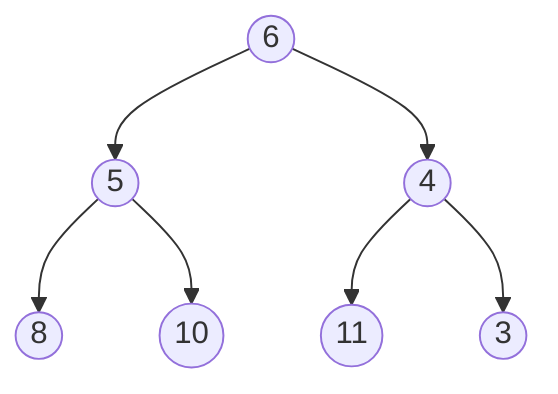
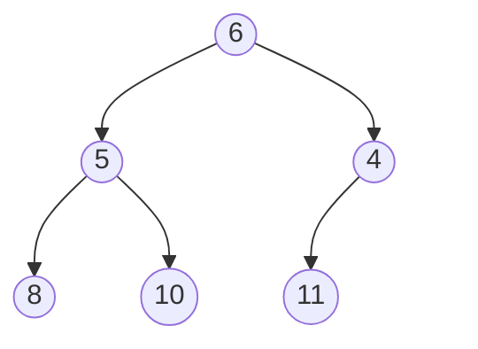
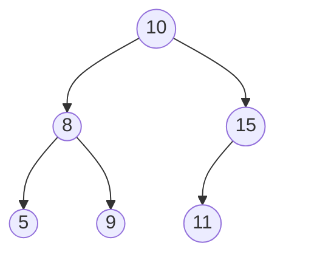

# 堆

堆用来解决一些需要快速排序，并且每次只关心排序后最值的问题。

C++ STL 中的优先队列就是用堆实现的。

堆是特殊的二叉树，有一个最重要的性质：对于堆中的任何一个节点，都保证其子节点的值严格大于父节点。

例如下面一张图就符合堆的性质


## 堆的操作

### 节点添加

设需要在上图中添加一个元素 4，我们可以这么做：

首先，我们先将要添加的节点放到最下一层最右边的叶子之后。如果最下一层已满，就新增一层。


而后，尝试让新的节点和其父节点交换位置。在这个例子中，显然，4 是比 6 要小的，为了保证堆的性质，我们要让 4 和 6 换个位置。



显然，3 是比 4 要小的，已经满足了堆的性质，这一次添加操作就此结束。

### 堆的删除

堆支持删除最顶上的一个节点。


为了对上面一张图的顶点（即值为 3 的点）进行删除，我们可以这样做：

首先，把这个点和最后一个点交换位置



再把最后一个点删掉



然后，由于这个图不满足堆的定义，所以我们从他的子节点中选择一个最小的，和根节点交换，作为新的根节点。


之后一直交换，直到其所有子节点都大于父节点，或没有子节点为止。

### 查询最小值

这个最简单，此时堆顶的元素最小，没有比它更小的了。

## 复杂度分析

节点添加操作平均是 $O(\log n)$ 的，但最坏 $O(n)$。

查询最小值 $O(1)$。

删除操作平均是 $O(\log n)$ 的，但最坏 $O(n)$。

---

> ## 例题：P3378 【模板】堆
> 
> ### 题目描述
> 
> 给定一个数列，初始为空，请支持下面三种操作：
> 
> 1. 给定一个整数 $x$，请将 $x$ 加入到数列中。
> 2. 输出数列中最小的数。
> 3. 删除数列中最小的数（如果有多个数最小，只删除 $1$ 个）。
> 
> ### 输入格式
> 
> 第一行是一个整数，表示操作的次数 $n$。
> 接下来 $n$ 行，每行表示一次操作。每行首先有一个整数 $op$ 表示操作类型。
> 
> - 若 $op = 1$，则后面有一个整数 $x$，表示要将 $x$ 加入数列。
> - 若 $op = 2$，则表示要求输出数列中的最小数。
> - 若 $op = 3$，则表示删除数列中的最小数。如果有多个数最小，只删除 $1$ 个。
> 
> ### 输出格式
> 
> 对于每个操作 $2$，输出一行一个整数表示答案。
> 
> 对于 $100\%$ 的数据，保证 $1 \leq n \leq 10^6$，$1 \leq x \lt 2^{31}$，$op \in \{1, 2, 3\}$。

---

## 标程

```cpp
#include <bits/stdc++.h>
using namespace std;
#define fa(x) (x / 2)
#define lson(x) (2 * x)
#define rson(x) (2 * x + 1)

const int N = 1e6 + 100;
const int root = 1;

int n;

class Heap
{
private:
    int size = 0;
    int a[N];

public:
    Heap()
    {
        memset(a, 0x3f, sizeof(a));
    }
    void push(int x)
    {
        a[++size] = x;
        int now = size;
        while (now > root)
        {
            if (a[now] < a[fa(now)])
            {
                swap(a[now], a[fa(now)]);
                now = fa(now);
            }
            else
                break;
        }
    }
    int query()
    {
        return a[root];
    }
    void remove()
    {
        int now = root;
        a[root] = a[size];
        size--;
        while (lson(now) <= size)
        {
            int minn = lson(now);
            if (rson(now) <= size && a[rson(now)] < a[minn])
                minn = rson(now);
            if (a[now] > a[minn])
            {
                swap(a[now], a[minn]);
                now = minn;
            }
            else
                break;
        }
    }
};

signed main()
{
    cin >> n;
    Heap heap;
    for (int i = 1; i <= n; i++)
    {
        int op;
        cin >> op;
        if (op == 1)
        {
            int x;
            cin >> x;
            heap.push(x);
        }
        if (op == 2)
            cout << heap.query() << endl;
        if (op == 3)
            heap.remove();
    }
    return 0;
}
```

# 二叉搜索树

二叉搜索树是一种特殊的树，其特点为：对于一个节点，其左子树上的节点总是小于父节点，而其右子树上的节点总是大于父节点。

例如下面一张图就符合二叉搜索树的性质



对于每一个节点，我们需要记录一些信息：

- `v`：该节点的值。
- `num`：为了让二叉搜索树能够存储重复的数据，我们将数值相同的节点合并。`num` 表示树中共有 `num` 个数值为 `v` 的值，即该节点是由 `num` 个节点合并而来的。
- `lson`：该节点的左子节点。
- `rson`：该节点的右子节点。
- `size`：以本节点为根的子树中一共有多少个数（此处不是节点，是因为每一个节点可能储存多个相同的数），包括根节点。

```cpp
struct Node {
    int v;
    int num;
    int size;
    Node* lson;
    Node* rson;
    Node(int v) :
        v(v),
        num(1),
        lson(nullptr),
        rson(nullptr),
        size(1)
    {
    }
    // 防空指针特判
    int lsize() {
        return lson ? lson->size : 0;
    }
    int rsize() {
        return rson ? rson->size : 0;
    }
};
```

> ## 例题：【模板】普通平衡树
> 
> ### 题目描述
> 
> 您需要动态地维护一个可重集合 $M$，并且提供以下操作：
> 
> 1. 向 $M$ 中插入一个数 $x$。
> 2. 从 $M$ 中删除一个数 $x$（若有多个相同的数，应只删除一个）。
> 3. 查询 $M$ 中有多少个数比 $x$ 小，并且将得到的答案加一。
> 4. 查询如果将 $M$ 从小到大排列后，排名位于第 $x$ 位的数。
> 5. 查询 $M$ 中 $x$ 的前驱（前驱定义为小于 $x$，且最大的数）。
> 6. 查询 $M$ 中 $x$ 的后继（后继定义为大于 $x$，且最小的数）。
> 
> 对于操作 $3,5,6$，**不保证**当前可重集中存在数 $x$。
> 
> 对于操作 $5,6$，保证答案一定存在。
> 
> ### 输入格式
> 
> 第一行为 $n$，表示操作的个数，下面 $n$ 行每行有两个数 $\text{opt}$ 和 $x$，$\text{opt}$ 表示操作的序号（$1 \leq \text{opt} \leq 6$）。
> 
> ### 输出格式
> 
> 对于操作 $3,4,5,6$ 每行输出一个数，表示对应答案。
> 
> 对于 $100\%$ 的数据，$1\le n \le 10^5$，$|x| \le 10^7$。

## 插入

插入很简单，只需要从根节点向下遍历一遍，找到最适合的位置。

对于一个节点 $k$，要在以该节点为根的子树中插入一个元素 $x$，有两种情况

- 若节点 $k$ 是空的，则将 $x$ 放在 $k$ 的位置。
- 若节点 $k$ 非空，则
    - $x = k$，将节点 $k$ 的 `num` 值增加即可。
    - $x\lt k$，可以转化为在节点为 $k_{lson}$ 为根的子树下插入元素 $x$。
    - $x \gt k$，可以转化为在节点为 $k_{rson}$ 为根的子树下插入元素 $x$。

最后，在统计 `size` 时，可以使用类似于线段树的 `pushup` 方法，将左右子树的 `size` 相加即可。

时间复杂度为 $O(h)$，$h$ 为高度，最坏 $O(n)$

```cpp
void insert(int x, Node*& node) {
    if (node == nullptr) {
        node = new Node(x);
        return;
    }
    if (x == node->v) {
        node->num++;
    }
    else if (x < node->v) {
        insert(x, node->lson);
    }
    else {
        insert(x, node->rson);
    }
    int lsonsize = node->lson ? node->lson->size : 0;
    int rsonsize = node->rson ? node->rson->size : 0;
    node->size = lsonsize + rsonsize + node->num;
}
```

## 查询排名

依旧的，进行一次搜索。

如果你想要查询 $x$ 在树中是排第几位的，那么只需要算出比 $x$ 小的数有几个，而后，将结果加一，即为排名。

特殊的，如果 $x$ 不存在，则假想 $x$ 存在，即定义 $x$ 的排名为比 $x$ 小的数的个数加一。

为了统计比 $x$ 小的数有几个，如果你当前遍历到节点 $k$，那么有以下三种情况：

- $x \lt k$，比 $x$ 小的数一定都在 $k$ 的左子树上，可以舍弃右子树，继续遍历左子树。
- $x=k$，其实和 $x \lt k$ 的情况是一样的。
- $x \gt k$，此时左子树中的一定都是比 $x$ 小的，右子树中有部分。将左子树和 $k$ 计入答案，继续遍历右子树。

```cpp
int rank(int x) {
    Node* root = this->root;
    int ans = 0;
    while (root) {
        if (x <= root->v) {
            root = root->lson;
        }
        else {
            ans += root->lsize() + root->num;
            root = root->rson;
        }
    }
    return ans + 1;
}
```

## 删除

为了删除 $x$，如果你当前遍历到节点 $k$，那么有以下三种情况：

- $x \lt k$，$x$ 一定在 $k$ 的左子树上，可以继续遍历左子树。
- $x \gt k$，$x$ 一定在 $k$ 的右子树上，可以继续遍历右子树。
- $x=k$
    - 如果 $k_{num} \ne 1$，即还有多个此种数字，那么直接让 $k_{num}-1$ 即可。
    - 否则，就需要删除这个节点
        - 如果节点 $k$ 没有子节点，直接删
        - 如果节点 $k$ 只有左子节点或右子节点，那么将其子节点覆盖父节点。
        - 如果 $k$ 有两个子节点，那么，寻找 $k$ 的前驱或后继，将其覆盖节点 $k$。可以证明，节点 $k$ 的前驱和后继分别在 $k$ 的左子树和右子树上。并且，$k$ 的前驱和后继必然大于原来 $k$ 的左子树上的节点且小于原来 $k$ 右子树上的节点。

```cpp
void remove(int x, Node*& node) {
    if (!node) return;

    if (x < node->v) {
        remove(x, node->lson);
    }
    else if (x > node->v) {
        remove(x, node->rson);
    }
    else {  // x == node->v
        if (node->num > 1) {
            node->num--;
        }
        else {
            // 删除整个节点
            if (node->lson == nullptr && node->rson == nullptr) {
                delete node;
                node = nullptr;
            }
            else if (node->lson == nullptr) {
                Node* t = node;
                node = node->rson;
                delete t;
            }
            else if (node->rson == nullptr) {
                Node* t = node;
                node = node->lson;
                delete t;
            }
            else {
                // 有两个子节点，找后继节点（右子树的最小值）
                Node* succ = node->rson;
                while (succ->lson != nullptr) {
                    succ = succ->lson;
                }
                // 用后继节点的值替换当前节点
                node->v = succ->v;
                node->num = succ->num;
                // 删除后继节点（设置num=1确保删除整个节点）
                succ->num = 1;
                remove(succ->v, node->rson);
            }
        }
    }

    if (node) node->size = node->lsize() + node->rsize() + node->num;
    return;
}
```

## 查询第几大

为了查询第 $x$ 大的数，如果你当前遍历到节点 $k$，若定义 $k$ 的左子树大小为 $k_{lsize}$，那么有以下三种情况：

- $x \le k_{lsize}$，即第 $x$ 大的数在 $k$ 的左子树，只需要继续遍历左子树即可。
- $k_{lsize} \gt x \le k_{lsize} + k_{num}$，即第 $x$ 大的数就是 $k$
- 否则，第 $x$ 大的数在 $k$ 的右子树，将 $x$ 减去左子树和 $k$ 点的数量后，继续遍历右子树。

```cpp
int kth(int x, Node* root) {
    while (root) {
        if (x <= root->lsize()) {
            root = root->lson;
        }
        else if (x <= root->lsize() + root->num) {
            return root->v;
        }
        else {
            x -= root->lsize() + root->num;
            root = root->rson;
        }
    }
    return -1;
}
```

## 查询前驱/后继

计算前驱（即最大的比 $x$ 小的数），可以得知 $x$ 的排名后，再将排名减一后查询第几大即可。

计算后缀，可以通过得知 $x+1$ 的排名后，通过这个排名来查询第几大。

```cpp
int pre(int x) {
    return kth(rank(x) - 1, root);
}
int succ(int x) {
    return kth(rank(x + 1), root);
}
```

## 时间复杂度

每一项操作的时间复杂度都是 $O(h)$，其中 $h$ 是深度，共有 $n$ 次操作，综合最坏 $O(n^2)$。

## 标程

```cpp
#include <bits/stdc++.h>
using namespace std;

const int N = 1e5 + 100;

int n;

struct Node {
    int v;
    int num;
    int size;
    Node* lson;
    Node* rson;
    Node(int v) :
        v(v),
        num(1),
        lson(nullptr),
        rson(nullptr),
        size(1)
    {
    }
    int lsize() {
        return lson ? lson->size : 0;
    }
    int rsize() {
        return rson ? rson->size : 0;
    }
};

class Tree {
public:
    Node* root = nullptr;
    void insert(int x, Node*& node) {
        if (node == nullptr) {
            node = new Node(x);
            return;
        }
        if (x == node->v) {
            node->num++;
        }
        else if (x < node->v) {
            insert(x, node->lson);
        }
        else {
            insert(x, node->rson);
        }
        node->size = node->lsize() + node->rsize() + node->num;
    }
    void remove(int x, Node*& node) {
        if (!node) return;

        if (x < node->v) {
            remove(x, node->lson);
        }
        else if (x > node->v) {
            remove(x, node->rson);
        }
        else {  // x == node->v
            if (node->num > 1) {
                node->num--;
            }
            else {
                // 删除整个节点
                if (node->lson == nullptr && node->rson == nullptr) {
                    delete node;
                    node = nullptr;
                }
                else if (node->lson == nullptr) {
                    Node* t = node;
                    node = node->rson;
                    delete t;
                }
                else if (node->rson == nullptr) {
                    Node* t = node;
                    node = node->lson;
                    delete t;
                }
                else {
                    // 有两个子节点，找后继节点（右子树的最小值）
                    Node* succ = node->rson;
                    while (succ->lson != nullptr) {
                        succ = succ->lson;
                    }
                    // 用后继节点的值替换当前节点
                    node->v = succ->v;
                    node->num = succ->num;
                    // 删除后继节点（设置num=1确保删除整个节点）
                    succ->num = 1;
                    remove(succ->v, node->rson);
                }
            }
        }

        if (node) node->size = node->lsize() + node->rsize() + node->num;
        return;
    }
    int rank(int x) {
        Node* root = this->root;
        int ans = 0;
        while (root) {
            if (x <= root->v) {
                root = root->lson;
            }
            else {
                ans += root->lsize() + root->num;
                root = root->rson;
            }
        }
        return ans + 1;
    }
    int kth(int x, Node* root) {
        while (root) {
            if (x <= root->lsize()) {
                root = root->lson;
            }
            else if (x <= root->lsize() + root->num) {
                return root->v;
            }
            else {
                x -= root->lsize() + root->num;
                root = root->rson;
            }
            ;
        }
        return -1;
    }

    int pre(int x) {
        return kth(rank(x) - 1, root);
    }
    int succ(int x) {
        return kth(rank(x + 1), root);
    }
};

int main() {
    cin >> n;
    Tree tree;
    for (int i = 1; i <= n; i++) {
        int opt, x;
        cin >> opt >> x;
        if (opt == 1) {
            tree.insert(x, tree.root);
        }
        if (opt == 2) {
            tree.remove(x, tree.root);
        }
        if (opt == 3) {
            cout << tree.rank(x) << endl;
        }
        if (opt == 4) {
            cout << tree.kth(x, tree.root) << endl;
        }
        if (opt == 5) {
            cout << tree.pre(x) << endl;
        }
        if (opt == 6) {
            cout << tree.succ(x) << endl;
        }
    }
    return 0;
}
```

