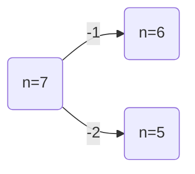
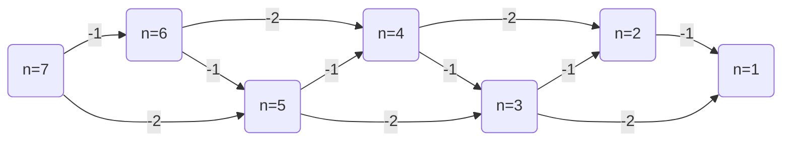
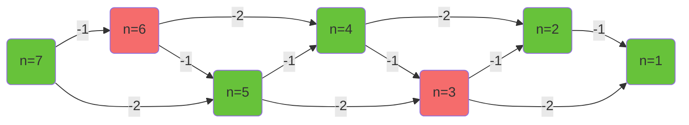

# 什么是博弈论

博弈论，即组合博弈，指一种游戏，这种游戏一般有以下性质：

1. 两人游戏，且轮流行动
2. 对等、完全
	 双方得知信息对等，双方可以进行的行动完全相同。
3. 确定性
	 游戏没有随机性的变量（如骰子、随机数等）
4. 无平局
5. 有限性
	 游戏无法无限继续，最终在一定时间内一定有一名玩家胜利，一名玩家失败。

# 相关定义

- 博弈论：研究**绝对理性**决策者之间战略互动的数学模型。
- N 必胜态：**至少存在**一种可能使得对方处于 P 的一种游戏局面被称为必胜态。
- P 必败态：**存在任意**一种方法让对方处于 N 的一种游戏局面被称为必败态。
- 终局：处于终局时，有且仅有一名玩家获得立即胜利。
	 如 FPS 游戏中，仅剩 1 名玩家存活就是一个终局。

# 解决博弈论的一般步骤

1. 明确终局
2. 进行倒推
3. 寻找规律
4. 进行数学证明（可以省略）

# 典例：

## 巴什博弈

考虑总共有 n 个物品，两名玩家，每次玩家必须至少取 1 个，最多取 m 个。最后一个物品十分值钱，取到最后一个物品的玩家获胜。

首先，检查这是不是博弈论：

| 项目         | 结果                         |
| ---------- | -------------------------- |
| 两人游戏，且轮流行动 | 符合，是两个人轮流行动                |
| 对等、完全      | 符合，每个人只能拿物品，且所有人都知道当前有多少物品 |
| 确定性        | 符合，没有随机因素                  |
| 无平局        | 符合，取到最后一个物品的玩家获胜，不会出现平局    |
| 有限性        | 符合，每次玩家必须至少取 1 个，不会出现取不完   |

所以下定结论，这是博弈论。

**明确终局**

很显然，终局是场上只剩下一个物品时，此时先手玩家N。

**进行倒推**

我们尝试推演当 $m=2$ 时的情景，其中，红色节点表示先手玩家 P，绿色节点代表先手玩家 N。

先选定一个起始节点，起始节点不宜太大，太大则会难于分析，需要选取适中的起始节点。在这里，选择起始节点 $n=7$。

尝试分析起始节点的胜负性。

首先，列举其所有可能的游戏发展子局面。例：$n=7$ 的子局面是 $n=6$（拿一个） 和 $n=5$（拿两个）

再列举起始节点所有可能的 游戏发展子局面（这里指 $n\in \{5,6\}$）的游戏发展子局面，一直下去，知道抵达终局（这里指 $n=1$）。

列举完之后如下图：

最后，给每一个节点染色。若处于当前局面时先手玩家 P 则将其染成红色，先手玩家 N 则将其染成绿色。

染色规则如下：

- 终局节点根据游戏规则染色（此题中为 N）
- 若一个节点其所有子节点全为 N，则该节点为 P，否则该节点为 N。

染色完如下：

列下表：

| m   | n   | 局势                           |
| --- | --- | ---------------------------- |
| 2   | 1   | N |
| 2   | 2   | N |
| 2   | 3   | P   |
| 2   | 4   | N |
| 2   | 5   | N |
| 2   | 6   | P   |
| 2   | 7   | N |

不难发现，当 $m=2$ 时，对于所有的 $n$，当且仅当 $3 \mid n$（$n$ 被 3 整除）时先手是 P 的，此外，先手都是 N 的。

**数学证明**

设整数 $k$ 满足 $k= n \bmod 3$，当 $k \in \{1,2\}$ 时，只需要拿取 $k$ 个，就可以转换为 $k=0$ 的情况，从而先手玩家必胜。当 $k=0$ 时，无论拿 1 个还是 2 个，都会转化为 $k \in \{1,2\}$ 的形式，从而先手玩家必败。

推广到 $m \neq 2$ 的情况：当 $(m+1) \mid n$ 时，先手是 P 的，此外的所有情况，先手都是 N 的。

## Nim 游戏 P2197

a_1 xor a_2 xor a_3 ... a_n = 0 => P

## 3. Anti-Nim P4279

## 4. 阶梯 Nim P2575
