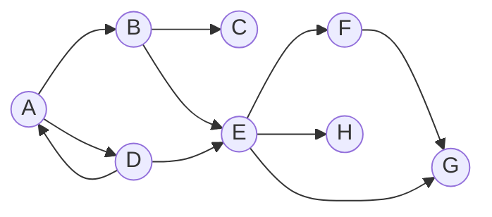
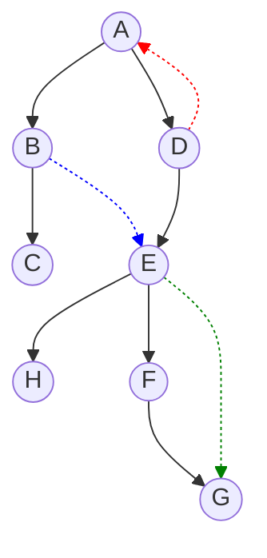

我们可以使用 tarjan 来求取一张有向图中强连通分量的个数，以及每个强连通分量包含的点的编号。

# 强连通

在一张**有向图**中，如果存在由一些点组成的集合，满足这个集合中的点都可以两两连通，那么称这些点和边为原图的**强连通子图**。

如果对于一个强连通子图 $T$，不存在任意一个其他点在加入 $T$ 后，能够仍然保持强连通子图的性质，那么称 $T$ 为原图的**强连通分量**。通俗来说，强连通分量就是**极大的**强连通图。

# DFS 生成树

在有向图上，以任意一个节点为根节点进行一次 DFS，我们可以使用**DFS 生成树**记录其过程。对于一个节点 A，其子节点 B 满足没有在图上出现过、且有一条边从 A 连接到 B。

DFS 生成树可以辅助将图转换为树 + 边。

示例：



对于上面这条边，如果以 A 为根节点建 DFS 生成树，一种是这样的：



在这张图中，有四种边：

- 树边：原有的，构成生成树的边
除此以外，还有三种额外的边（假定这些边是从节点 $u$ 连接到节点 $v$ 的）：
- <font color="red">反祖边</font>：$v$ 是 $u$ 的祖先节点。
- <font color="green">前向边</font>：$u$ 不是 $v$ 的父节点，但是是 $v$ 的祖先节点。
- <font color="blue">横叉边</font>：不是树边、<font color="red">反祖边</font>和<font color="green">前向边</font>的边。

不难发现，每一个强连通分量都**至少有一条**<font color="red">反祖边</font>。

**如何在 DFS 的同时判断一条边是什么边？**

我们需要定义一些数据：

- `bool in_stack[i]` 表示点 $i$ 是否在当前 DFS 的路径上。
- `bool vis[i]` 表示点 $i$ 是否被访问过。

|                 | **`in_stack` 成立**             | **`in_stack` 不成立**                                            |
| --------------- | ---------------------------- | ------------------------------------------------------------ |
| **`vis[i]` 成立**  | <font color="red">反祖边</font> | <font color="green">前向边</font>或<font color="blue">横叉边</font> |
| **`vis[i]` 不成立** | 不可能                          | 树边                                                           |

# Tarjan 求强连通分量

Tarjan 只需要进行一次 DFS 搜索就能办到。

为了解决问题，我们定义了以下数据：

- `bool in_stack[i]` 表示点 $i$ 是否在当前 DFS 的路径上。
- `stack<int> s` 当前强连通分量中的节点编号。
- `int dfn[i]` 第 $i$ 个点先序遍历到达时间。
- `int low[i]` 第 $i$ 个点通过当前子树内返祖边（即不经过其父节点）回到的最小时间。
- 无需定义 `vis[i]`，应为 `vis[i]` 等效于 `dfn[i] == 0`。

不难发现：

1. 祖先 `dfn` 一定小于当前 `dfn`。
2. 如果一个点 $u$ 能够到达一个点 $v$，点 u 的 `dfn` 大于点 v 的 `dfn`，那么这样的一组构成了一个强连通分量

对于到达一个新的节点 $u$，我们会进行以下操作：

- 初始化操作
	- 初始化 `dfn[u]`
	- 初始化 `low[u] = dfn[u]`
	- 将当前节点入栈 `s`，并且标记 `in_stack`。
- 遍历所有起点为 $u$，终点为 $v$ 的边
	- 如果这条边是<font color="red">反祖边</font>，将 `low[u]` 进行更新。
	- 如果这条边是树边，DFS 搜索节点 $v$，然后将 `low[u]` 进行更新。
	- 如果这条边是<font color="blue">横叉边</font>或<font color="green">前向边</font>，那么说明 $v$ 已搜索完毕，其所在连通分量已被处理，所以不用对其做操作。
- 检查当前节点是不是一个新的强连通分量的根节点（`low[u] == dfn[u]`）
	- 如果是，那么当前 `s` 中存储的就是一个强连通分量。清空 `s`，初始化 `in_stack` 来处理下一个强连通分量。

## 时间复杂度分析

- 初始化操作：$O(n)$
- 遍历边操作：$O(m)$
- 检查节点是不是强连通分量的根节点：$O(n)$

综合一下，时间复杂度 $O(m+n)$

# 标程

下面这个程序求解了图中的强连通分量数量和每一个强连通分量的组成部分。

```cpp
#include <bits/stdc++.h>
using namespace std;

const int N = 1e4 + 100;

int m, n, ans;
vector<int> e[N];

//bool in_stack[i]表示点i是否在当前DFS的路径上。
//stack<int> s当前强连通分量中的节点编号。
//int dfn[i]第i个点先序遍历到达时间。
//int low[i]第i个点通过当前子树内返祖边回到的最小时间。
int dfn[N], low[N], cnt;
bool in_stack[N];
stack<int> s;

void tarjan(int u)
{
	if (dfn[u] != 0)
		return;
	// 初始化
	dfn[u] = ++cnt;
	low[u] = dfn[u];
	in_stack[u] = true;
	s.push(u);
	// 搜索边
	for (auto v : e[u])
	{
		// 如果是返祖边
		if (in_stack[v])
		{
			// 那么刷新low[u]
			low[u] = min(low[u], low[v]);
		}
		// 如果是树边
		else if (!dfn[v])
		{
			// 递归处理
			tarjan(v);
			low[u] = min(low[u], low[v]);
		}
		// 如果是横插边或前向边
		else
		{
			// 节点v已经被处理或将被处理
			// 什么也不用做
		}
	}
	// 检查现在的节点是不是强连通分量的根节点。
	if (low[u] == dfn[u]) // 如果说这个节点最小只能到达自己
	{
		// 那么这个节点就是强连通分量的根节点。
		ans++;
		vector<int> v;
		while (s.top() != u)
		{
			v.push_back(s.top());
			in_stack[s.top()] = false;
			s.pop();

		}
		v.push_back(s.top());
		in_stack[s.top()] = false;
		s.pop();
		cout << v.size() << " ";
		for (auto it : v)
		{
			cout << it << " ";
		}
		cout << endl;
	}
}

signed main()
{
#ifndef ONLINE_JUDGE
	freopen(R"(E:\code\C++\sandbox\sandbox\in.txt)", "r", stdin);
#endif
	cin >> n >> m;
	for (int i = 1; i <= m; i++)
	{
		int u, v;
		cin >> u >> v;
		e[u].push_back(v);
	}
	for (int i = 1; i <= n; i++)
	{
		tarjan(i);
	}
	cout << ans << endl;
	return 0;
}
```
